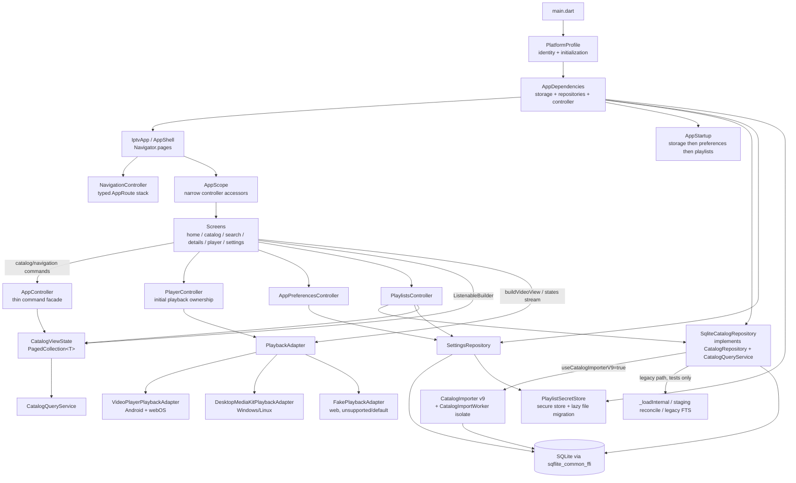

# Architecture & Code Improvements Plan

> **Audience:** AI coding agents first, humans second.
> **Source:** Audit performed against [flutter-architecture-engineering-audit.md](flutter-architecture-engineering-audit.md) on 2026-10-03 (commit `357bb4a`, "Add search").
> **Targets:** Android (phone + Android TV), Windows, LG webOS (TV). Linux desktop is a development target only.

---

## 0. How an agent must use this document

1. **Pick exactly one work package (WP)** whose dependencies are all `DONE` in the [status table](#1-work-package-status). Do not combine work packages in one change unless the WP says so.
2. **Read the WP fully**, then read every file listed under *Touches* before editing. Line numbers in this document are hints from the audit snapshot; re-locate code by symbol name.
3. **Read the skills listed in the WP** (paths under `.agents/skills/`) before implementing.
4. **Preserve behaviour** unless the WP explicitly changes it. These are refactors and fixes, not rewrites.
5. **Verify** with the commands under *Verify*. The baseline for every WP is:
   ```powershell
   flutter analyze
   flutter test
   ```
   Both must be green (analyzer: no *new* issues) before you mark a WP done.
6. **Update the status table** in this file (`TODO` → `DONE`, add the date and a one-line note). If you discover the WP is wrong or blocked, set it to `BLOCKED` and write why — do not improvise a different design.
7. **Respect [Open decisions](#9-open-decisions-requiring-a-human).** If a WP depends on an undecided item, stop and ask.
8. Never weaken the [architecture rules](#5-architecture-rules-the-contract) to make a change pass. If a rule blocks a legitimate change, record it in the WP notes and ask.

Known toolchain gotchas (from repo memory, keep in mind):

- `testWidgets` runs in a FakeAsync zone: real `Future.delayed`/`Timer` never fires unless the test pumps time.
- Fire-and-forget DB work must tolerate the database being closed by a test's `tearDown`.
- Killed benchmark/test runs can leave `flutter_tester.exe` holding `build\native_assets\...\sqlite3.dll`. Fix: `Get-Process flutter_tester,dart | Stop-Process -Force; Remove-Item -Recurse -Force build\native_assets`.
- `tool/benchmark_import.dart` can only run via `flutter test test/benchmark/import_benchmark.dart`.

---

## 1. Work package status

| WP | Title | Batch | Depends on | Size | Status |
|----|-------|-------|-----------|------|--------|
| WP-0.1 | Add `AGENTS.md` with project rules | 0 Guardrails | – | S | DONE (2026-10-03): Added concise root rules; detailed references linked. |
| WP-0.2 | Tighten lints, clear analyzer baseline | 0 Guardrails | – | S | DONE (2026-10-03): Seven additional lints enabled; analyzer clean; webOS plugin pinned. |
| WP-0.3 | Architecture boundary test | 0 Guardrails | – | S | DONE (2026-10-03): Added platform/layer import checks with an exact exception allowlist; 122 tests pass. |
| WP-0.4 | Fix mojibake strings in settings | 0 Guardrails | – | XS | DONE (2026-10-03): Corrected five import-progress labels; no mojibake matches remain. |
| WP-1.1 | Android manifest: network + TV launcher | 1 Critical fixes | – | XS | DONE (2026-10-03): Added network/TV manifest declarations and banner; release APK builds. Android TV/HTTP device smoke test pending. |
| WP-1.2 | Stop playback when leaving the player | 1 Critical fixes | – | XS | DONE (2026-10-03): Stop playback on every player exit; guard late load completion; widget regression test passes. |
| WP-1.3 | Handle system Back / Escape at the shell | 1 Critical fixes | – | S | DONE (2026-10-03): PopScope and Escape/Back shortcuts return to Home; widget tests pass. Android TV/webOS hardware key validation pending. |
| WP-1.4 | Stop displaying/logging credential-bearing URLs | 1 Critical fixes | – | S | DONE (2026-10-03): Removed raw URL UI fields; centralized URL/error redaction and added unit/widget coverage. |
| WP-1.5 | Honest secret storage (rename + platform secure store) | 1 Critical fixes | D-3 | M | DONE (2026-10-03): Renamed the file store, added secure plugin storage and lazy migration; analyzer/tests pass. Android/Windows native builds and webOS hardware verification remain pending. |
| WP-1.6 | Real playback on Android | 1 Critical fixes | D-4 | S | BLOCKED (2026-10-03): Android now selects the video_player adapter and the factory regression test passes; Android debug build fails compiling generated package_info_plus/wakelock_plus registrant references, so stream playback is not yet verified. |
| WP-2.1 | `lib/platform/`: platform identity + capabilities | 2 Platform boundary | WP-0.3 | S | DONE (2026-10-04): Added platform identity, injected capability environment, centralized build flags, and platform detection tests; analyzer and all 135 tests pass. |
| WP-2.2 | Composition root (`AppDependencies`) | 2 Platform boundary | WP-2.1 | M | DONE (2026-10-04): Added platform profiles and `AppDependencies`; removed storage singleton/default controller dependencies and moved startup/disposal to the composition root; all 135 tests pass. Analyzer has one unrelated `unawaited_futures` info in `webos/flutter/main.dart`. |
| WP-2.3 | Move playback backend selection into profiles | 2 Platform boundary | WP-2.2 | S | DONE (2026-10-04): Profiles now choose video_player, MediaKit, or fake playback and initialize MediaKit only for desktop; removed the platform-aware service factory and trivial desktop wrappers. All 140 tests pass; analyzer has one unrelated webOS info. |
| WP-2.4 | Move database factory selection into profiles | 2 Platform boundary | WP-2.2 | S | DONE (2026-10-04): `SqfliteDatabaseAdapter` now takes an injected `DatabaseFactory`; profiles initialize/provide FFI for Android/Windows/Linux/webOS and preserve Android's support-directory path. Removed platform checks/global assignment; all 141 tests pass. Analyzer has one unrelated webOS info. |
| WP-2.5 | Replace `isDesktop` layout check with width + input | 2 Platform boundary | WP-2.1 | S | DONE (2026-10-04): Sidebar uses available width >= 1050 on every platform; pointer, arrow-key/Enter filtering and narrow/wide resize coverage pass. Platform exception allowlist is empty; all 141 tests pass. Analyzer retains one unrelated webOS info. |
| WP-3.1 | Typed route stack + `Navigator.pages` | 3 Navigation & state | WP-1.3, D-1 | M | DONE (2026-10-05): Added sealed route types and a Home-rooted `NavigationController`; `Navigator.pages` retains prior screens, typed params replace navigation side fields, and Back/Escape plus scroll restoration tests pass. |
| WP-3.2 | Split `AppController` into feature controllers | 3 Navigation & state | WP-3.1, WP-2.2 | L | DONE (2026-10-05): Extracted playlist, preferences, initial player, and startup owners; explicit load intents replace flags, narrow subscriptions isolate rebuilds, and AppController is a thin catalog/navigation facade. All 163 tests pass; analyzer retains one unrelated webOS info. |
| WP-3.3 | Typed app preferences (no magic setting keys) | 3 Navigation & state | WP-3.2 | S | DONE (2026-10-07): Added typed preference storage and controller commands, including active playlist persistence; keys remain only in the wrapper and unchanged seed. All 182 tests pass; analyzer retains one unrelated webOS info. |
| WP-3.4 | Remove dead code + dedupe error handling in controllers | 3 Navigation & state | WP-3.2 | S | DONE (2026-10-07): Removed unused save/retry methods and unified playlist failures under one operation boundary; retained activeIssue after checking usages. All 193 tests pass; analyzer retains one unrelated webOS info. |
| WP-4.1 | Design tokens + 10-foot theme | 4 TV UX | – | S | DONE (2026-10-07): Extracted shared geometry and current dark theme; capability-based 16/18px body text, 48/56px command targets, input-aware focus and reduced motion. All 203 tests pass; analyzer retains one unrelated webOS info. Native TV readability checks pending. |
| WP-4.2 | Shared focusable `MediaTile` | 4 TV UX | WP-4.1 | M | TODO |
| WP-4.3 | Root key map (Shortcuts/Actions, remote keys) | 4 TV UX | WP-2.1, WP-3.1 | M | TODO |
| WP-4.4 | Focus groups, initial focus, focus restoration | 4 TV UX | WP-4.2, WP-4.3, WP-4.7 | M | TODO |
| WP-4.5 | Adaptive fullscreen player screen | 4 TV UX | WP-3.2, WP-4.3, WP-7.1 | M | TODO |
| WP-4.6 | Cross-device accessibility and focus tests | 4 TV UX | WP-4.4, WP-4.5 | M | TODO |
| WP-4.7 | Adaptive shell and browsing layouts | 4 TV UX | WP-4.1, WP-3.1, WP-2.1, D-10 | M | TODO (2026-10-07): Added for compact/medium/expanded layouts; navigation composition requires D-10 approval. |
| WP-5.1 | Feature folders + split large screen files | 5 UI structure | WP-3.2 | M | TODO |
| WP-5.2 | Shared paged grid/list + state views | 5 UI structure | WP-5.1 | S | TODO |
| WP-5.3 | Shared formatters + `CatalogItemKind` presentation | 5 UI structure | – | XS | TODO |
| WP-6.1 | Port legacy-path tests to the v9 catalog | 6 Data layer | D-2 | L | TODO |
| WP-6.2 | Delete the legacy (v1–v7) catalog code path | 6 Data layer | WP-6.1 | L | TODO |
| WP-6.3 | Split `SqliteCatalogRepository` by responsibility | 6 Data layer | WP-6.2 | L | TODO |
| WP-6.4 | Startup maintenance without downcasts | 6 Data layer | WP-6.3, WP-2.2 | S | TODO |
| WP-6.5 | One HTTP playlist client | 6 Data layer | WP-6.2 | S | TODO |
| WP-7.1 | `PlayerController` owns the playback session | 7 Playback | WP-3.2 | M | TODO |
| WP-7.2 | Typed playback errors, shared mapper | 7 Playback | WP-7.1 | S | TODO |
| WP-7.3 | Lifecycle: pause/release when hidden | 7 Playback | WP-7.1 | S | TODO |
| WP-8.1 | Shared test support (`test/support/`) | 8 Testing | – | S | TODO |
| WP-8.2 | High-value missing tests | 8 Testing | WP-8.1 | M | TODO |
| WP-9.1 | Logging: injected logger, redaction, no `print` | 9 Observability | WP-2.2 | S | TODO |
| WP-9.2 | No raw exception text in the UI; no silent swallows | 9 Observability | WP-9.1 | S | TODO |

Size guide: XS < 30 min of agent work, S = one focused change, M = several files, L = multi-step; split L packages into sub-commits that each keep tests green.

---

## 2. Executive summary

The app is a working IPTV client with a **genuinely strong data/import core** (isolate-based streaming import, durable import sessions, set-based SQL reconcile, external-content FTS, paged queries, generation-guarded pagination) and a **thin, under-structured UI/app layer** that was built as scaffolding and has not yet been shaped for a TV-first, multi-platform product.

The main problems, in order of impact:

1. **Platform correctness gaps.** Android has no real playback (falls back to `FakePlaybackAdapter`), the Android release manifest has no `INTERNET` permission, and system Back on Android/TV exits the app because nothing intercepts it.
2. **No TV interaction model.** There are zero `Focus`/`Shortcuts`/`Actions` usages in `lib/`. Focus visuals, remote keys, focus restoration and directional navigation are all left to Material defaults.
3. **Platform decisions are scattered.** Platform checks live in a screen (`catalog_screen.dart`), the storage adapter, the playback factory and `main.dart`, with webOS detected via a `dart-define`. There is no single place that answers "what platform am I and what can it do?".
4. **Two god objects.** `AppController` (navigation + playlists + settings + playback + error state) and `SqliteCatalogRepository` (~3,400 non-blank lines containing two complete catalog implementations: the legacy v1–v7 path and the production v9 path).
5. **Security/hygiene.** Playlist credentials are stored as plaintext JSON in a class named `FlutterSecurePlaylistSecretStore`; credential-bearing stream URLs are rendered in the Details and Player screens.

The fix is **not** a new framework. The current choices — `ChangeNotifier` + `InheritedNotifier`, constructor injection, interface-based repositories, a `PlaybackAdapter` contract — are appropriate and should stay. The plan adds:

- a `lib/platform/` boundary + a composition root, so platform differences are resolved **once** at startup and the rest of the code reads **capabilities**, never platform names;
- a typed route stack rendered through `Navigator.pages`, which fixes Back handling, focus restoration and scroll preservation together;
- feature controllers carved out of `AppController`;
- a small design system with a focusable tile, so TV focus behaviour is implemented once;
- removal of the dead legacy catalog path, then a responsibility split of the repository.

---

## 3. Current architecture

### 3.1 Actual dependency flow



### 3.2 Platform boundaries today

| Where | What decides | Mechanism |
|-------|--------------|-----------|
| [main.dart](../lib/main.dart) | Which profile is initialized and dependencies are built | `detectAppPlatform()` → `PlatformProfile` → `AppDependencies` |
| [platform_profile.dart](../lib/platform/platform_profile.dart) | Playback/database backends, initialization, and secret store | Exhaustive `AppPlatform` profile selection plus desktop build flags |
| [playback_adapter.dart](../lib/services/playback/playback_adapter.dart) | Playback contract and implementation exports | No platform-selection logic |
| [database_adapter.dart](../lib/services/storage/database_adapter.dart) | Open the database and run migrations | Uses the injected database factory and directory resolver |
| [catalog_screen.dart](../lib/screens/catalog_screen.dart) | Whether the group sidebar is shown | `LayoutBuilder` available width >= 1050 regardless of OS/input type |

Note: Flutter webOS reports a Linux-like `TargetPlatform`, so `defaultTargetPlatform` alone cannot identify webOS. That is why the `IPTV_WEBOS` define exists — this constraint is real and must be kept.

### 3.3 Healthy boundaries (keep them)

- **Screens never touch SQL, HTTP or M3U parsing.** All data access goes through `CatalogQueryService` / `SettingsRepository` / `CatalogRepository` interfaces.
- **The UI never holds the full catalog.** `CatalogViewState` + `PagedCollection<T>` hold one page window, with generation tokens that drop stale responses.
- **Import runs off the UI isolate** (`CatalogImportWorker`) with batching, back-pressure and cancellation, and records durable `import_sessions` for crash recovery.
- **Playback is behind a contract** (`PlaybackAdapter`, `PlaybackState`, `PlaybackCapabilities`) and screens already render controls from capabilities, not from platform names.
- **Errors have a user-safe taxonomy** (`AppIssue`, `AppIssueKind`, `AppIssueSource`).
- **Tests use hand-written fakes and in-memory implementations** (`InMemoryCatalogQueryService`, `FakePlaybackAdapter`, `InMemoryPlaylistSecretStore`) instead of mocks.

### 3.4 Leaking boundaries

| Leak | Evidence | Consequence |
|------|----------|-------------|
| ~~Platform checks in UI~~ | `_GroupSidebarLayout` uses `LayoutBuilder` constraints | Resolved by WP-2.5: wide layouts show the sidebar on every platform; group controls retain keyboard navigation. |
| ~~Global singleton behind default args~~ | `AppStorageBootstrap` and optional `AppController` repository/playback args | Resolved by WP-2.2: `AppDependencies` constructs and owns application services; tests inject dependencies. |
| Concrete-type downcast in app state | `if (repository is SqliteCatalogRepository) { recoverAbandonedImports(); resumeSearchIndexing(); }` | App state knows the storage implementation; startup maintenance is invisible to other repositories. |
| Settings keys as strings across layers | `'show_home_live_tv'` in `settings_screen.dart`, `app_controller.dart`, `database_adapter.dart` | A typo silently creates a new setting; no type safety. |
| Screens pass raw exception text to users | `PagedCollection._errorMessage = '$error'`, shown by `_PagedGrid` | Users see `SqliteException(...)` strings. |
| ~~Navigation is a mutable enum on the god controller~~ | Typed `AppRoute` stack in `NavigationController`, rendered by `Navigator.pages` | Resolved by WP-3.1: route parameters replace navigation side fields; Back pops actual page history and covered page state is retained. |

---

## 4. Findings

Format: **ID — title** · Severity · Confidence · Category. Each finding is referenced by the work package that fixes it.

### Critical / High

**F-01 — Android plays nothing.** Critical · High · Platform/Media
- Location: `PlatformProfile.createPlaybackAdapter()` in [platform_profile.dart](../lib/platform/platform_profile.dart).
- Problem: Android now selects `VideoPlayerPlaybackAdapter`; Android build and device-stream validation remain blocked/pending.
- Why it matters: Android is a declared target; playback is the product.
- Recommendation: reuse the `video_player`-based adapter for Android. → **WP-1.6** (selection moved into profiles by WP-2.3)
- Effort: S · Risk: Low.

**F-02 — Android release build has no network permission and no TV launcher.** Critical · High · Platform
- Location: [android/app/src/main/AndroidManifest.xml](../android/app/src/main/AndroidManifest.xml).
- Problem: no `android.permission.INTERNET` (debug/profile manifests add it, release does not); no `LEANBACK_LAUNCHER` category; `android.hardware.touchscreen` not marked optional; no cleartext policy although IPTV streams are frequently `http://`.
- Why it matters: release APKs cannot fetch playlists; the app will not appear on Android TV home screens and may be filtered from TV stores.
- Recommendation: → **WP-1.1**. Effort: XS · Risk: Low.

**F-03 — System Back exits the app; leaving the player keeps playing.** High · High · TV UX/Media
- Location: [app.dart](../lib/app.dart) (`AppShell` and `Navigator.pages`), route-change handling in [app_controller.dart](../lib/state/app_controller.dart).
- Problem: the original single-route and continued-playback defects are addressed by WP-1.2, WP-1.3, and WP-3.1. System Back/Escape and player-stop behavior have widget coverage; Android TV/webOS hardware Back still needs device validation.
- Recommendation: retain hardware validation as a release check; player-session ownership remains **WP-7.1**.
- Effort: XS–S · Risk: Low.

**F-04 — No remote-control interaction model.** High · High · TV UX
- Location: all of `lib/screens/`, `lib/widgets/`.
- Evidence: `grep Focus|Shortcuts|Actions|LogicalKeyboardKey` in `lib/` → 0 hits (only one `autofocus: true` on the search field).
- Problem: tiles are `Card(InkWell)` with Material's default faint focus overlay; no initial focus on any screen; no focus restoration after Back; no mapping for remote Back/media keys; no `FocusTraversalGroup` separating top nav, group sidebar and grid; the Settings entry is an `IconButton` with only a tooltip.
- Why it matters: webOS and Android TV are remote-only. The architecture doc ([architecture.md §9](architecture.md)) already requires a single focus strategy built on `FocusTraversalGroup`/`Shortcuts`/`Actions`; it was never implemented.
- Recommendation: **WP-4.1 → WP-4.6**. Effort: M–L · Risk: Medium (touches every screen).

**F-05 — Playlist credentials stored in plaintext under a misleading name.** High · High · Security
- Location: `FlutterSecurePlaylistSecretStore` in [secure_storage_service.dart](../lib/services/storage/secure_storage_service.dart).
- Problem: writes `{"value": "<url with credentials>"}` as JSON files in the app-support directory. The name implies `flutter_secure_storage`; no such dependency exists in `pubspec.yaml`. [architecture.md §7](architecture.md) requires secure storage for credential-bearing URLs.
- Recommendation: rename honestly now; introduce real per-platform secure storage behind the existing `PlaylistSecretStore` interface. → **WP-1.5** (needs decision **D-3**).
- Effort: M · Risk: Medium (data migration of existing secrets).

**F-06 — Credential-bearing URLs rendered and logged.** High · Medium · Security
- Location: `SelectableText(item.streamUrl)` in [details_screen.dart](../lib/screens/details_screen.dart) and [player_screen.dart](../lib/screens/player_screen.dart); `AppIssue.details: error.toString()` and `_logger.error(error: ...)` in `AppController.loadPlaylist`; `HttpException(..., uri: Uri.parse(url))` in `HttpPlaylistSource`.
- Problem: Xtream stream URLs embed `username/password` in the path. They are shown on screen (TV screens get photographed/shared) and exception strings that include the URI flow into `AppIssue.details` and logs.
- Confidence is Medium only for the log path (depends on which exception surfaces from the v9 worker); the on-screen rendering is certain.
- Recommendation: → **WP-1.4**, **WP-9.1**.

**F-07 — `SqliteCatalogRepository` contains two catalog implementations.** High · High · Maintainability/Data
- Location: [sqlite_catalog_repository.dart](../lib/services/catalog/sqlite_catalog_repository.dart) (~3,400 non-blank lines).
- Problem: production uses `useCatalogImporterV9: true` ([storage_bootstrap.dart](../lib/services/storage/storage_bootstrap.dart)), but the class still carries the full legacy path: `_loadInternal`, three-tier reconcile (`_reconcileViaStagingSql` → `_reconcilePlaylistContent` → per-item savepoints), legacy staging, legacy FTS queue/worker, `_ImportSessionRecorder`, plus the coordinator's legacy `parse`/`parseStream` isolates. Every read query first runs `_hasV9Catalog(...)` and then branches into v9 or legacy SQL.
- Why it matters: an agent modifying "the catalog" has two plausible code paths and cannot tell which is live; every read pays an extra query; most of `storage_pipeline_test.dart`, `search_index_queue_test.dart`, `catalog_import_concurrency_test.dart` protect the dead path.
- Recommendation: port behaviour-protecting tests to v9, delete the legacy path, then split the remainder by responsibility. → **WP-6.1 → WP-6.3** (needs decision **D-2**).
- Effort: L · Risk: Medium (well covered by tests once ported).

**F-08 — Application state was concentrated in `AppController`.** High · High · Architecture/State
- Location: [app_controller.dart](../lib/state/app_controller.dart) (original audit: ~770 non-blank lines).
- Original responsibilities included navigation, playlist CRUD/import/refresh/progress, preferences, playback orchestration, startup sequencing, and catalog binding.
- Resolved in WP-3.1/WP-3.2: navigation is owned by `NavigationController`; playlist state and operations by `PlaylistsController`; preferences by `AppPreferencesController`; initial playback orchestration by `PlayerController`; startup sequencing by `AppStartup`. `AppController` is a thin catalog/navigation command facade, scheduled for later removal.
- Screens subscribe to the narrow controller state they render; playlist progress no longer notifies Home/Catalog through one application-wide notifier.
- The richer playback state bridge and session command API remain **WP-7.1**.
- Effort: L · Risk: Medium.

**F-09 — Platform knowledge is scattered.** High · High · Platform/Architecture
- See [§3.2](#32-platform-boundaries-today). There is no type that represents "this device", so every new platform difference adds another `if`.
- Recommendation: **WP-2.1 → WP-2.5** and the boundary test in **WP-0.3**.

### Medium

**F-10 — Duplicated tile UI with no focus treatment.** Medium · High · UI/TV UX
- Six near-identical `Card → InkWell → Padding → Column(icon/title/subtitle)` tiles: `_ContentGrid`, `_SeriesGrid`, `_SeasonGrid`, `_EpisodeGrid` ([catalog_screen.dart](../lib/screens/catalog_screen.dart)), `_ContentCard`, `_SeriesStrip` ([home_screen.dart](../lib/screens/home_screen.dart)). Grid delegates are re-declared with slightly different sizes (300×180, 300×150, 320×170). → **WP-4.2**, **WP-5.2**.

**F-11 — Large screen files mix unrelated responsibilities.** Medium · High · Maintainability
- `settings_screen.dart` (~620 lines): settings toggles, playlist list, playlist card, live import-progress widget with its own timer, add/edit form dialog with validation, delete confirmation, date/byte/elapsed formatting. These are separable and independently testable. → **WP-5.1**.
- `catalog_screen.dart` (~490 lines): five screen variants + paging + group sidebar. The paging/sidebar pieces are reusable; the variants are cohesive enough to stay together after tiles move out.

**F-12 — Player screen is a diagnostics page.** Medium · High · TV UX/Media
- Renders the stream URL, ISO timestamps, "Startup latency", "Volume 25%/100%" buttons, inside a `Scaffold(AppBar)` with a 720 px max width. No fullscreen video, no overlay controls, no remote media keys. `_statusLabel(state.status.name)` switches on strings instead of the enum. → **WP-4.5**, **WP-7.1**.

**F-13 — Settings keys and preferences are untyped.** Medium · High · Maintainability
- `'show_home_live_tv'`, `'show_home_movies'`, `'show_home_series'`, `'verbose_refresh_info'`, `'active_playlist_id'` are string literals spread across screen, controller and DB seed; booleans parsed by a hand-written `_parseBoolOrDefault`. → **WP-3.3**.

**F-14 — Dead and duplicated code in the controller.** Medium · High · Maintainability
- Resolved by **WP-3.4**: Find Usages confirmed the unused `savePlaylist()` / `retryActiveIssue()` chain, which was removed. `openCatalog()` / `goHome()` were already absent after the controller split; `activeIssue` is retained because regression tests consume its typed error state.
- `savePlaylistUrl`, `saveXtreamPlaylist`, and `loadPlaylist` now share one `_runPlaylistOperation` failure boundary for issue conversion, redacted logging, and error-state updates. Worker error classification and refresh cleanup remain covered by tests.

**F-15 — Raw exception text in UI; silent swallows.** Medium · High · Error handling
- `PagedCollection._fetch` stores `'$error'`; `_loadBrowseGroups` stores `'$error'`; both are rendered.
- `AppController._openPlayerFor` has `catch (_) { notifyListeners(); }` with no log.
- `.catchError((Object _, StackTrace __) {})` / `=> 0` in repository background workers (intentional per repo notes, but nothing is logged).
- `print()` in `SqfliteDatabaseAdapter.initialize` (analyzer `avoid_print`).
→ **WP-9.1**, **WP-9.2**.

**F-16 — Mojibake in user-visible strings.** Medium · High · UI
- `settings_screen.dart` import-progress labels contain `…` (UTF-8 `…` decoded as Windows-1252). → **WP-0.4**.

**F-17 — Search screen polls the database every second.** Medium · Medium · Performance
- `SearchScreen` starts `Timer.periodic(1s)` calling `refreshSearchIndexStatus()` for as long as the screen is visible, even when indexing has finished. Cheap per call, but unnecessary work on TV hardware. Stop polling when `pendingItems == 0` or push status from the indexer. → **WP-5.2** (or WP-6.3 when the indexer is split).

### Low

**F-18 — `loadMore` scheduled from `itemBuilder`.** Low · High · Flutter
- `_PagedGrid` and the search list register a post-frame callback for every item built in the last 30 slots. `loadMore()` is idempotent, so this is wasteful rather than wrong. Replace with one scroll-position/notification-driven trigger in the shared paged view. → **WP-5.2**.

**~~F-19 — Trivial subclasses / aliases.~~** Low · High · Maintainability · Resolved by WP-1.6 and WP-2.3
- Removed `WebOsPlaybackAdapterStub` during WP-1.6 and the empty Windows/Linux wrappers during WP-2.3; platform profiles construct shared adapters directly.

### Explicitly *not* findings

- `ChangeNotifier` + `InheritedNotifier` is an appropriate state approach for this app. **Do not** migrate to Riverpod/Bloc/Provider.
- The architecture skill suggests `freezed` and `get_it`. **Do not** add them: hand-written immutable classes are already used consistently, and constructor injection + one composition root is sufficient.
- `PlaybackAdapter.buildVideoView()` returning a `Widget` from a service is a pragmatic boundary for platform video surfaces. Keep it.
- `CatalogImporter` and `CatalogImporterWarm` (split via a private extension) are large because the domain is large; they are cohesive. Do not split further without a concrete reason.
- `storage_migrations.dart` is large by nature; migrations are append-only and must not be refactored.

---

## 5. Architecture rules (the contract)

These rules are what WP-0.1 writes into `AGENTS.md` and what WP-0.3 enforces with a test. Every later WP must leave them satisfied.

### 5.1 Layers and allowed imports

```text
lib/
  main.dart                  thin: detect platform → build dependencies → runApp
  app/                       MaterialApp, root shortcuts, navigation, composition root
  platform/                  THE ONLY place that knows which OS/build it is
  features/<feature>/        screens + feature widgets + feature controllers
  ui/                        design tokens, theme, shared widgets, formatters
  state/                     cross-feature state (CatalogViewState, PagedCollection)
  services/                  data layer: repositories, query services, import, storage, playback contracts
  models/                    plain immutable domain models
```

| Layer | May import | Must not import |
|-------|-----------|-----------------|
| `features/`, `ui/` | `ui/`, `state/`, `models/`, service **interfaces**, `app/navigation` | `sqflite*`, `sqlite3`, `dart:io`, `media_kit*`, `video_player*`, `platform/` implementations, any `Sqlite*` class |
| `state/` | `models/`, service interfaces | `package:flutter/material.dart`, `features/`, `platform/` |
| `services/` | `models/`, other services | `features/`, `ui/`, `state/`, `package:flutter/material.dart` |
| `platform/` | anything it adapts | `features/`, `ui/` |
| `app/` | everything (composition root) | – |

### 5.2 Platform rule (the "no `if (platform == Windows)`" rule)

Only files under `lib/platform/` may reference `defaultTargetPlatform`, `TargetPlatform`, `Platform.` (from `dart:io`), `kIsWeb`, or `bool/String.fromEnvironment` for platform/backend selection.

Everything else receives what it needs through one of three channels, which must never be conflated:

| Question | Answer comes from | Example |
|----------|------------------|---------|
| *Which implementation do I construct?* | `PlatformProfile` factories, called once in the composition root | playback backend, database factory, secret store, key map |
| *What can this device/input do?* | `PlatformCapabilities` (injected, read via `AppEnvironment.of(context)`) and `FocusManager.instance.highlightMode` | show focus rings, has hardware Back, supports pointer hover, supports DRM |
| *How much room do I have?* | `LayoutBuilder` constraints / `MediaQuery.sizeOf(context)` | sidebar vs no sidebar, grid columns |

Never infer form factor from OS ("Android == phone", "Windows == desktop"). Android covers phones and TVs; Windows can be a small window.

### 5.3 State and navigation

- One typed route stack (`sealed class AppRoute`) is the single source of truth for "where am I". Back = pop.
- Controllers are `ChangeNotifier`s, constructed with their dependencies, provided by `InheritedNotifier`s. Widgets depend on the **narrowest** notifier they need.
- Controllers expose state + command methods; they never import `material.dart` and never build widgets.
- Ephemeral UI state (text controllers, debounce timers, hover/focus) stays in `State` objects.

### 5.4 Errors, logging, secrets

- User-facing errors are `AppIssue`s (or typed error enums) mapped to text in the UI. Never render `'$error'`.
- Every `catch` either rethrows, converts to a typed error, or logs through `AppLogger`. No empty catches.
- Never render, log or put into `AppIssue.details` a URL that may contain credentials; use the shared redaction helper.

### 5.5 Testing

- Business logic must be testable without widgets: controllers and services take interfaces in their constructors.
- Use hand-written fakes from `test/support/`. Do not add `mockito` unless a fake would be unreasonable (see `.agents/skills/dart-generate-test-mocks`).
- Every bug fix gets a regression test; every TV-navigation change gets a key-event widget test.

---

## 6. Platform strategy in detail

This section is the design reference for Batch 2. It is intentionally small.

### 6.1 Platform identity (resolved once)

```dart
// lib/platform/app_platform.dart — the only file that inspects the runtime.
enum AppPlatform { android, windows, linux, webos, other }

const bool _isWebOsBuild = bool.fromEnvironment('IPTV_WEBOS');

AppPlatform detectAppPlatform() {
  if (_isWebOsBuild) return AppPlatform.webos; // webOS reports a Linux-like TargetPlatform.
  if (kIsWeb) return AppPlatform.other;
  return switch (defaultTargetPlatform) {
    TargetPlatform.android => AppPlatform.android,
    TargetPlatform.windows => AppPlatform.windows,
    TargetPlatform.linux => AppPlatform.linux,
    _ => AppPlatform.other,
  };
}
```

### 6.2 Capabilities (what the rest of the app reads)

```dart
// lib/platform/platform_capabilities.dart
enum PrimaryInput { remote, pointer, touch }

@immutable
class PlatformCapabilities {
  const PlatformCapabilities({
    required this.primaryInput,
    required this.hasHardwareBack,
    required this.supportsHover,
  });

  final PrimaryInput primaryInput;
  final bool hasHardwareBack;
  final bool supportsHover;

  bool get isRemoteFirst => primaryInput == PrimaryInput.remote;
}
```

- Keep the class small. Add a field only when a feature needs it, and document which feature.
- Playback capabilities stay on `PlaybackAdapter.capabilities` (they belong to the backend, not the device).
- Focus *visuals* should follow `FocusManager.instance.highlightMode` (Flutter switches between `traditional` and `touch` from the last input event). That works for hybrid devices (Android TV with a touch remote, Windows with keyboard + mouse) without any platform logic.
- Android phone vs Android TV: start with `primaryInput: touch` for Android and rely on `highlightMode` to show focus when a D-pad is used. Only add TV detection (e.g. `android.software.leanback` system feature) if a concrete feature requires it — see **D-5**.

### 6.3 Platform profile (what the composition root calls)

```dart
// lib/platform/platform_profile.dart
abstract interface class PlatformProfile {
  AppPlatform get platform;
  PlatformCapabilities get capabilities;
  Future<void> initialize();                 // e.g. MediaKit.ensureInitialized()
  PlaybackAdapter createPlaybackAdapter();
  DatabaseFactory createDatabaseFactory();
  PlaylistSecretStore createSecretStore();
  Map<ShortcutActivator, Intent> get extraShortcuts; // e.g. webOS remote Back key
}

PlatformProfile platformProfileFor(AppPlatform platform) => switch (platform) {
  AppPlatform.webos => WebOsProfile(),
  AppPlatform.android => AndroidProfile(),
  AppPlatform.windows => DesktopProfile.windows(),
  AppPlatform.linux => DesktopProfile.linux(),
  AppPlatform.other => FakeProfile(),
};
```

- A single exhaustive `switch` on a sealed/enum type is the **one** sanctioned platform branch in the codebase. Adding a platform = add an enum value + a profile; the compiler lists every place to update.
- Dev-only knobs (`IPTV_DESKTOP_BACKEND`, `IPTV_DISABLE_VIDEO_OUTPUT`, `IPTV_DISABLE_HW_ACCEL`, `PLAYBACK_SPIKE_AUTORUN`) are read inside the profiles, not in screens or `app.dart`.

### 6.4 Composition root

```dart
// lib/main.dart
Future<void> main() async {
  WidgetsFlutterBinding.ensureInitialized();
  final profile = platformProfileFor(detectAppPlatform());
  await profile.initialize();
  final deps = AppDependencies.create(profile, logger: const DebugAppLogger());
  GlobalErrorHandler(deps.logger)..install();
  runApp(IptvApp(dependencies: deps));
}
```

`AppDependencies` owns construction and disposal of the database adapter, repositories, playback adapter and controllers. It replaces `AppStorageBootstrap.instance` and the default-argument fallbacks in `AppController`. Tests build an `AppDependencies.forTesting(...)` with fakes.

### 6.5 Dependency/platform compatibility watch-list

| Dependency | Android | Windows | webOS | Note |
|-----------|---------|---------|-------|------|
| `media_kit`, `media_kit_video`, `media_kit_libs_video` | supported | supported | **not used** | Imported unconditionally by `main.dart` today; after WP-2.3 only the desktop profile imports it. |
| `video_player` + `video_player_webos` (git) | supported (ExoPlayer) | not supported | supported | webOS plugin pinned to commit `3a742bb86b04e261044f0864f9b1f71acf0bbad3`. |
| `sqflite_common_ffi` + `sqlite3` (native assets) | works | works | **verify** | Repo notes mention `sqflite_webos`; current code uses FFI on webOS because `Platform.isLinux` is true. Confirm on hardware before changing (WP-2.4). |
| `path_provider` | supported | supported | via `path_provider_webos` | Verify the webOS implementation is registered. |
| Secure storage | `flutter_secure_storage` | `flutter_secure_storage` | `flutter_secure_storage` + pinned LG implementation | D-3 selected; webOS requires `securitykey.operation` and hardware verification. |

Do not assume a package works on webOS because it works on Linux desktop.

---

## 7. Work packages

Each WP lists: **Goal · Fixes · Depends on · Touches · Steps · Acceptance · Verify · Out of scope · Skills.**

### Batch 0 — Guardrails (do first; cheap; make later batches safer)

#### WP-0.1 — Add `AGENTS.md` with project rules
- **Goal:** give every future agent the project-specific knowledge a generic Flutter agent lacks.
- **Touches:** new `AGENTS.md` at repo root.
- **Steps:** create `AGENTS.md` using the outline in [§10](#10-agentsmd-outline). Link to this document and to `docs/decisions.md`. Keep it under ~150 lines; link rather than copy.
- **Acceptance:** file exists; every rule in [§5](#5-architecture-rules-the-contract) is summarised; known gotchas from [§0](#0-how-an-agent-must-use-this-document) are listed.
- **Verify:** none beyond review.

#### WP-0.2 — Tighten lints, clear analyzer baseline
- **Goal:** zero analyzer issues so new issues are visible.
- **Touches:** `analysis_options.yaml`, the 9 files currently reported, `pubspec.yaml` (pin `video_player_webos` git `ref`).
- **Steps:**
  1. Fix current issues: `use_build_context_synchronously` (settings_screen ~L593), `use_null_aware_elements`, `unnecessary_underscores`, `avoid_print` (database_adapter — replace with logger or delete; tool/ scripts may keep `print` via `// ignore_for_file: avoid_print`).
  2. Enable additionally: `unawaited_futures`, `prefer_final_locals`, `avoid_dynamic_calls`, `always_declare_return_types`, `cancel_subscriptions`, `close_sinks`, `directives_ordering`. Fix or explicitly `unawaited(...)` the findings. If one rule produces > 30 findings, enable it in a separate commit.
  3. Pin `video_player_webos` to a commit `ref`.
- **Acceptance:** `flutter analyze` → "No issues found!".
- **Skills:** `dart-run-static-analysis`.

#### WP-0.3 — Architecture boundary test
- **Goal:** make the rules in [§5.1](#51-layers-and-allowed-imports) and [§5.2](#52-platform-rule-the-no-if-platform--windows-rule) executable.
- **Touches:** new `test/architecture/architecture_rules_test.dart`.
- **Steps:**
  1. Plain `test()` that walks `lib/**.dart` with `dart:io`, reads each file, and checks regexes:
     - outside `lib/platform/`: no `defaultTargetPlatform`, `TargetPlatform.`, `Platform.is`, `kIsWeb`, `fromEnvironment(`.
     - in `lib/screens/`, `lib/features/`, `lib/ui/`, `lib/widgets/`: no imports of `sqflite`, `sqlite3`, `dart:io`, `media_kit`, `video_player`, `sqlite_catalog_repository.dart`, `storage_bootstrap.dart`.
     - in `lib/state/` and `lib/services/`: no `package:flutter/material.dart`.
  2. Seed a `const knownViolations = <String, String>{path: reason}` allowlist with today's violations (main.dart, app.dart, catalog_screen.dart, playback_adapter.dart, database_adapter.dart). The test fails on *new* violations and also fails if an allowlisted file no longer violates (forcing allowlist cleanup).
- **Acceptance:** test passes on current code; adding `defaultTargetPlatform` to any screen makes it fail.
- **Skills:** `dart-add-unit-test`, `dart-use-path-package`.

#### WP-0.4 — Fix mojibake strings
- **Touches:** `lib/screens/settings_screen.dart` (`_ImportProgressIndicatorState.build`).
- **Steps:** replace `…` with `…` (U+2026). Search `lib/` and `test/` for `â€` to catch others. Ensure the file is saved as UTF-8.
- **Acceptance:** `grep "â€" lib test` → no hits.

### Batch 1 — Critical correctness & security fixes (small, independent)

#### WP-1.1 — Android manifest: network + TV launcher
- **Fixes:** F-02.
- **Touches:** `android/app/src/main/AndroidManifest.xml`, optionally `android/app/src/main/res/xml/network_security_config.xml`.
- **Steps:**
  1. Add `<uses-permission android:name="android.permission.INTERNET"/>`.
  2. Add `<uses-feature android:name="android.hardware.touchscreen" android:required="false"/>` and `<uses-feature android:name="android.software.leanback" android:required="false"/>`.
  3. Add `<category android:name="android.intent.category.LEANBACK_LAUNCHER"/>` to the main activity intent filter and an `android:banner` (320×180 drawable; placeholder acceptable, note it in the WP status).
  4. Allow cleartext traffic (`android:usesCleartextTraffic="true"` or a network security config). IPTV providers commonly serve `http://`.
- **Acceptance:** release APK can fetch an `http://` playlist; app appears in the Android TV launcher (manual check, record result).
- **Verify:** `flutter build apk --release` succeeds.

#### WP-1.2 — Stop playback when leaving the player
- **Fixes:** F-03 (playback half).
- **Touches:** `lib/state/app_controller.dart` (`goBack`, any navigation away from `AppScreen.player`).
- **Steps:** when leaving `AppScreen.player` by any path, `await playbackAdapter.stop()` (guard errors, log them). Add a widget/unit test with `FakePlaybackAdapter` asserting state is `stopped` after Back.
- **Acceptance:** test passes; manual: audio stops on Back.
- **Out of scope:** the full `PlayerController` (WP-7.1).

#### WP-1.3 — Handle system Back / Escape at the shell
- **Fixes:** F-03 (navigation half).
- **Touches:** `lib/app.dart` (`AppShell`).
- **Steps:**
  1. Wrap `AppShell`'s content in `PopScope(canPop: controller.screen == AppScreen.home, onPopInvokedWithResult: (didPop, _) { if (!didPop) controller.goBack(); })`.
  2. Add `Shortcuts`/`Actions` at the shell mapping `LogicalKeyboardKey.escape` and `LogicalKeyboardKey.goBack` to a `BackIntent` that calls `controller.goBack()` (desktop keyboard + remotes that send goBack).
  3. Widget test: on a catalog screen, `tester.binding.handlePopRoute()` returns to Home and the app is still mounted; Escape does the same.
- **Acceptance:** tests pass. Record on-device results for Android TV and webOS (webOS Back may arrive as a different key — that is handled by WP-4.3's platform key map).
- **Out of scope:** replacing the `AppScreen` enum (WP-3.1).

#### WP-1.4 — Stop displaying/logging credential-bearing URLs
- **Fixes:** F-06.
- **Touches:** `lib/screens/details_screen.dart`, `lib/screens/player_screen.dart`, new `lib/services/security/url_redaction.dart` (or reuse `SqliteCatalogRepository._redactUrl` logic — move it there), `lib/state/app_controller.dart` (issue details / logging), `HttpPlaylistSource`.
- **Steps:**
  1. Create `String redactUrl(String url)` that strips userinfo, query values and Xtream-style `/<user>/<pass>/` path segments (pattern: `/(live|movie|series)/<user>/<pass>/`). Unit-test it with Xtream, plain M3U and token-query examples.
  2. Remove `SelectableText(item.streamUrl)` from Details and Player (show group/kind instead). If a diagnostics view is wanted, show `redactUrl(...)` only when "verbose information" is enabled.
  3. In `AppController` catch blocks, pass `redactUrl`-sanitised text into `AppIssue.details`; ensure `HttpException` messages do not include the raw URI (pass a redacted `uri`).
  4. Replace the private `_redactUrl` in the repository with the shared helper.
- **Acceptance:** `grep -n "streamUrl" lib/screens` shows no `Text`/`SelectableText` rendering; redaction tests pass.

#### WP-1.5 — Honest secret storage
- **Fixes:** F-05. **Blocked by decision D-3.**
- **Touches:** `lib/services/storage/secure_storage_service.dart`, `pubspec.yaml`, profiles from WP-2.2 (or `storage_bootstrap.dart` if done before Batch 2).
- **Steps:**
  1. Rename `FlutterSecurePlaylistSecretStore` → `FilePlaylistSecretStore` (it is what it is). Pure rename, own commit.
  2. Add `SecurePlaylistSecretStore` backed by the plugin chosen in D-3, implementing `PlaylistSecretStore`.
  3. Add a one-time migration: on first read miss, look in the file store; if found, write to secure store and delete the file.
  4. Select the implementation per platform (profile `createSecretStore()`).
- **Acceptance:** existing playlists still load after upgrade (test with a temp directory seeded by `FilePlaylistSecretStore`); no `*.json` secret files remain after migration.

#### WP-1.6 — Real playback on Android
- **Fixes:** F-01. **Blocked by decision D-4** (recommended: `video_player`).
- **Touches:** `lib/services/playback/webos_playback.dart`, `playback_adapter.dart`, `test/playback_adapter_test.dart`.
- **Steps:**
  1. Rename `WebOsPlaybackAdapter` → `VideoPlayerPlaybackAdapter` (file `video_player_playback.dart`); keep a `typedef` only if tests need it, then remove `WebOsPlaybackAdapterStub`.
  2. Return it for `TargetPlatform.android` in `createPlatformPlaybackAdapter()` (this function moves into profiles in WP-2.3; a temporary branch here is acceptable and allowlisted).
  3. Update `playback_adapter_test.dart` expectations.
- **Acceptance:** Android debug build plays the public HLS test stream (`AppController.playbackSpikeItem` URL). Record device/emulator used.

### Batch 2 — Platform boundary (core of the "no platform ifs" goal)

Read [§6](#6-platform-strategy-in-detail) before starting this batch.

#### WP-2.1 — `lib/platform/`: identity + capabilities
- **Fixes:** F-09 (foundation).
- **Touches:** new `lib/platform/app_platform.dart`, `lib/platform/platform_capabilities.dart`, `lib/platform/app_environment.dart` (an `InheritedWidget` exposing `PlatformCapabilities`).
- **Steps:** implement exactly the shapes in §6.1/§6.2. Unit-test `detectAppPlatform()` using `debugDefaultTargetPlatformOverride`. Move the `IPTV_*` `fromEnvironment` constants from `playback_adapter.dart` into `lib/platform/build_flags.dart` and re-export temporarily if needed.
- **Acceptance:** architecture test allowlist shrinks (playback_adapter flags moved).
- **Skills:** `dart-use-pattern-matching`.

#### WP-2.2 — Composition root (`AppDependencies`)
- **Fixes:** F-08 (hidden deps), F-09.
- **Touches:** new `lib/app/app_dependencies.dart`, new `lib/platform/platform_profile.dart` + one profile per platform, `lib/main.dart`, `lib/app.dart`, `lib/state/app_controller.dart` (constructor), `lib/services/storage/storage_bootstrap.dart` (delete at the end), tests that construct `IptvApp`/`AppController`.
- **Steps:**
  1. Create `PlatformProfile` (§6.3) with `initialize()`, `createPlaybackAdapter()`, `createSecretStore()`; initially delegate to existing functions.
  2. Create `AppDependencies` that builds `SqfliteDatabaseAdapter`, `SqliteCatalogRepository(useCatalogImporterV9: true)`, `SqliteSettingsRepository`, the playback adapter and `AppController`; owns `dispose()`.
  3. Make `AppController`'s constructor parameters **required** (no `AppStorageBootstrap.instance` fallbacks, no `createPlatformPlaybackAdapter()` fallback).
  4. `IptvApp` takes `AppDependencies` (or the controller + capabilities) and no longer calls `AppStorageBootstrap`. Move `PLAYBACK_SPIKE_AUTORUN` handling into the profile/dev flags.
  5. Delete `AppStorageBootstrap`.
- **Acceptance:** no `AppStorageBootstrap` references; `main.dart` matches §6.4 in shape; all tests green.
- **Skills:** `flutter-apply-architecture-best-practices` (constructor injection part only — no `get_it`).

#### WP-2.3 | Move playback backend selection into profiles
- **Fixes:** F-09, F-19.
- **Touches:** `lib/services/playback/*`, `lib/platform/*_profile.dart`, `lib/main.dart`.
- **Steps:** move `createPlatformPlaybackAdapter`/`shouldInitializeMediaKit` logic into the profiles; `MediaKit.ensureInitialized()` lives in `DesktopProfile.initialize()`; delete `WindowsPlaybackAdapter`, `LinuxPlaybackAdapter`; `main.dart` no longer imports `media_kit`. Optionally move backend implementations to `lib/platform/playback/` (contract stays in `lib/services/playback/playback_contract.dart`).
- **Acceptance:** architecture test allowlist no longer contains `main.dart` or `playback_adapter.dart`.

#### WP-2.4 | Move database factory selection into profiles
- **Fixes:** F-09.
- **Touches:** `lib/services/storage/database_adapter.dart`, profiles.
- **Steps:** `SqfliteDatabaseAdapter` takes a `DatabaseFactory` in its constructor instead of reading `Platform.is*` and mutating the global `databaseFactory`. Profiles provide `databaseFactoryFfi` (after `sqfliteFfiInit()`) for Android/Windows/Linux/webOS as today. **Do not change the webOS backend in this WP**; just move the decision. Replace the two `print` calls with the injected logger (if WP-0.2 did not already).
- **Acceptance:** `database_adapter.dart` has no `dart:io` `Platform` usage; tests inject `databaseFactoryFfi` explicitly (also removes the repeated "databaseFactory reassigned" warnings noted in repo memory).

#### WP-2.5 | Replace `isDesktop` layout check with width + input
- **Fixes:** F-09, responsive guidance.
- **Touches:** `lib/screens/catalog_screen.dart` (`_DesktopGroupLayout`), `test/widget_test.dart`.
- **Steps:**
  1. Rename `_DesktopGroupLayout` → `_GroupSidebarLayout`. Show the sidebar when `constraints.maxWidth >= 1050` regardless of OS.
  2. The sidebar must be reachable by D-pad (it is a `ListView` of `ListTile`s, which are focusable; WP-4.4 adds the traversal group). Do not hide it on TV.
  3. Update the widget test: remove `variant: TargetPlatformVariant.only(TargetPlatform.windows)`; add a narrow-width case asserting no sidebar.
- **Acceptance:** no platform check in `catalog_screen.dart`; allowlist entry removed. **After this WP the allowlist should only contain `lib/platform/**`.**
- **Skills:** `flutter-build-responsive-layout`.

### Batch 3 — Navigation & state decomposition

#### WP-3.1 — Typed route stack rendered with `Navigator.pages`
- **Fixes:** F-03, F-08 (navigation half), enables focus restoration (WP-4.4). **Decision D-1 resolved: option A.**
- **Touches:** new `lib/app/navigation/app_route.dart`, `lib/app/navigation/navigation_controller.dart`, `lib/app.dart`, `lib/state/app_controller.dart`, all screens' `open*`/`goBack` call sites, tests asserting `controller.screen`.
- **Design:**
  ```dart
  sealed class AppRoute { const AppRoute(); }
  final class HomeRoute extends AppRoute { const HomeRoute(); }
  final class CatalogRoute extends AppRoute { const CatalogRoute(this.kind); final CatalogItemKind kind; }
  final class SeriesRoute extends AppRoute { const SeriesRoute(); }
  final class SeasonsRoute extends AppRoute { const SeasonsRoute(this.series); final SeriesSummary series; }
  final class EpisodesRoute extends AppRoute { const EpisodesRoute(this.series, this.season); ... }
  final class DetailsRoute extends AppRoute { const DetailsRoute(this.item); final ContentItem item; }
  final class PlayerRoute extends AppRoute { const PlayerRoute(this.item); final ContentItem item; }
  final class SearchRoute extends AppRoute { const SearchRoute(); }
  final class SettingsRoute extends AppRoute { const SettingsRoute(); }
  ```
  `NavigationController extends ChangeNotifier` holds `List<AppRoute> stack` with `push`, `pop`, `replaceTop`, and `resetTo`. Home remains the root; top-level section navigation resets to Home and pushes the selected section. `AppShell` renders `Navigator(pages: [for (r in stack) MaterialPage(key: ValueKey(r), child: screenFor(r))], onDidRemovePage: ...)`; system Back is allowed to leave only when Home is the sole page.
- **Steps:**
  1. Add the sealed route hierarchy and `NavigationController`; replace `AppScreen` and navigation side fields rather than keeping compatibility state.
  2. Make top-level section navigation preserve Home as root; push nested series, details, player, and settings routes so Back returns to the exact prior context.
  3. Pass route parameters into screen constructors; render the full route list with `Navigator.pages` and synchronize Navigator page removals back to the controller.
  4. Keep system Back and Escape routed through the stack; stop playback when the active PlayerRoute is removed.
  5. Test stack transitions, Home-rooted system Back/Escape, and catalog scroll restoration after Details → Back.
- **Acceptance:** Back from Episodes → Seasons → Series → Home follows route history; system Back and Escape return to Home from a top-level section; catalog scroll position is preserved after Details → Back. Unit and widget coverage added.
- **Skills:** `dart-use-pattern-matching`.

#### WP-3.2 — Split `AppController` into feature controllers
- **Fixes:** F-08.
- **Touches:** `lib/state/app_controller.dart` → new files; `lib/widgets/app_scope.dart`; all screens; tests.
- **Target split (keep `ChangeNotifier`):**
  | Controller | Owns | Moves from `AppController` |
  |-----------|------|---------------------------|
  | `NavigationController` | route stack | done in WP-3.1 |
  | `PlaylistsController` | playlists list, active playlist, add/edit/delete, refresh, import progress, last issue | `savePlaylistUrl`, `saveXtreamPlaylist`, `loadPlaylist`, `refreshPlaylist`, `selectPlaylist`, `deletePlaylist`, `importProgress`, `refreshingPlaylistId`, `playlistStatus`, `errorMessage` |
  | `AppPreferencesController` | home row visibility, verbose info | `showHome*`, `verboseRefreshInfo`, setters |
  | `PlayerController` | playback session | `_openPlayerFor`, spike (WP-7.1 completes it) |
  | `CatalogViewState` | unchanged | – |
  | `AppStartup` (plain class, not a notifier) | startup sequence: storage init, recovery, resume indexing, restore active playlist | `initialize()` |
- **Steps:**
  1. Extract one controller per commit, starting with `AppPreferencesController` (smallest), then `PlaylistsController`, then `AppStartup`.
  2. Provide each via its own `InheritedNotifier` (or a single `AppScope` exposing separate `Listenable`s with `static X xOf(context)` accessors). Screens depend only on what they use — this fixes the whole-app rebuild on import progress.
  3. Replace `loadPlaylist`'s five boolean flags with an explicit intent: `enum PlaylistLoadIntent { startup, activate, refreshActive, refreshInactive, setup }` mapped to policy/flags inside the controller.
  4. Each controller gets a unit test file in `test/state/` covering its transitions with fakes.
- **Implementation notes (2026-10-05):** `AppScope` provides separate controller accessors; widgets subscribe through `ListenableBuilder` to the state they render. Added `activateNext` (cache-first next-playlist fallback after deletion) and `refreshCompleted` (cache-only rebind without navigation when selection changed during refresh) load intents to preserve the existing behaviors without public boolean flags. `PlayerController` initially owns adapter loading, spike, exit stopping, and late-load protection; the WP-7.1 state bridge is deferred. `AppController` retains only catalog/navigation commands and is scheduled for later removal.
- **Acceptance:** `app_controller.dart` is deleted or reduced to a thin façade scheduled for removal; no screen calls `AppScope.of(context)` to get a do-everything object; controller unit tests exist.
- **Skills:** `flutter-apply-architecture-best-practices`, `dart-add-unit-test`.

#### WP-3.3 — Typed app preferences
- **Fixes:** F-13.
- **Touches:** new `lib/services/settings/app_preferences.dart`, `AppPreferencesController`, `settings_screen.dart`, `database_adapter.dart` (seed), `_TestSettingsRepository`.
- **Steps:** define `enum AppPreference<T>`-style keys or a small `AppPreferences` class with typed getters/setters (`Future<bool> showHomeLiveTv()`, ...) over `SettingsRepository.get/setAppSetting`. Move `_parseBoolOrDefault` there. Keys appear exactly once in `lib/` (plus the migration seed, which must keep its literals).
- **Implementation notes (2026-10-07):** Added `AppPreferences` with named boolean getters/setters and active-playlist ID accessors. The preferences controller and Settings screen no longer accept raw setting keys; `PlaylistsController` also uses the wrapper for startup restoration, activation, and clearing. Preserved existing boolean aliases/defaults, canonical writes, notifications, and empty-string playlist clearing. The seed in `database_adapter.dart` remains unchanged; the widget-test repository now leaves missing-setting defaults to the wrapper. Added unit coverage for parsing, fallback, persistence, notifications, and startup restoration. Full suite: 182 passing; `flutter analyze` reports only the existing `unawaited_futures` info in `webos/flutter/main.dart`.
- **Acceptance:** `grep "'show_home_" lib` → only `app_preferences.dart` and the migration seed.

#### WP-3.4 — Remove dead code, dedupe controller error handling
- **Fixes:** F-14.
- **Steps:** delete `savePlaylist`, `retryActiveIssue`, `openCatalog`, `goHome` and `activeIssue` if still unused after WP-3.2 (re-check with *Find usages*). Introduce one private `Future<bool> _runPlaylistOperation(String op, {required String host, required Future<void> Function() body})` that does the `AppIssueException`/generic catch + logging once.
- **Implementation notes (2026-10-07):** Removed the reference-confirmed dead save/retry chain from `PlaylistsController`. The navigation methods were already absent; `activeIssue` remains because controller/widget tests read its kind. URL/Xtream saves and catalog loads share one catch-and-log boundary, with source/context parameters preserving setup versus import messages, log event names, supplied issue metadata, and worker-specific classification. Caller-owned progress cleanup and load policies are unchanged. Worker stack traces are now redacted consistently. Added 11 regression cases covering both save paths, typed/generic/worker failures, redaction, recovery, and refresh cleanup. All 193 tests pass; analyzer reports only the existing `unawaited_futures` info in `webos/flutter/main.dart`.
- **Acceptance:** no duplicate catch blocks; tests green.

### Batch 4 — TV / 10-foot UX

**Design baseline (2026-10-07):** Read [Cross-Device Design Contract](design-guidelines.md) before every UI package. The [Kanal concept](Kanal_%20IPTV%20TV%20experience%20concept.html) supplies visual/interaction direction, not approval for new product behavior. Product intent remains in [Product & UX Requirements](IPTV_App_Product_UX_Requirements.md); the scoped WPs and [decisions](decisions.md) control delivery. Do not copy the concept's fixed canvas or sample data into production.

**Order:** WP-4.1 first; WP-4.2, WP-4.3, and WP-4.7 can then proceed as their dependencies permit; WP-4.4 follows the adaptive shell. Complete WP-7.1 before WP-4.5. WP-4.6 consolidates cross-device coverage, but every implementation WP must add its own scoped tests immediately. Existing stop-on-player-exit, All-group defaults, and activation destinations remain unchanged unless a separately approved behavioral package changes them.

**Scope boundary:** Mini player/system PiP, EPG/live preview, quality folding, metadata/rating sorting, history-backed Home/resume, autoplay, sports/recommendations, voice search, theme selection, and branding are follow-up product work. Track candidate follow-ups in the design contract; define independent packages and prerequisites before implementing them. D-7/D-8/D-9/D-10 are pending choices, not implicit approvals.

#### WP-4.1 — Design tokens + 10-foot theme
- **Fixes:** F-10 (foundation), consistency.
- **Touches:** new `lib/ui/theme/app_tokens.dart`, `lib/ui/theme/app_theme.dart`, `lib/app.dart`, screens/widgets containing the extracted literals, focused theme tests.
- **Steps:**
  1. Tokens for the values repeated across screens today: page horizontal padding `40`, section gap `28`, card padding `14/16`, grid spacing `20`, tile extents (`300×180`, `320×170`), focus ring width/color, corner radius.
  2. `AppTheme.dark()` builds `ThemeData` with semantic color roles initially preserving the current background `0xff071412`, a `focusColor`, `CardThemeData`, and visibly focused button states. Add discrete compact and remote-first typography/target-size tokens; remote-first body starts at 18 logical px, compact at 16. Use constraints for space, injected capabilities for distant-viewing defaults, and highlight mode for focus visuals; width or keyboard activity alone must not classify a device as TV. Preserve text scaling and reduced motion.
  3. Replace literals in screens with tokens (mechanical; no layout changes).
- **Acceptance:** `app.dart` uses `AppTheme.dark()`; scoped tests verify semantic roles, focus/selection distinction, minimum targets, large text and compact/remote density without overflow. Measure token contrast. No shell/navigation redesign in this WP; new palette/light variant requires D-9 approval, but extracting the current dark theme is unblocked.
- **Implementation notes (2026-10-07):** Added `AppTokens` and `AppTheme.dark()` preserving the existing dark ColorScheme and scaffold background. Extracted repeated page/card/grid/tile/radius values across screens and the shell without changing their numeric values. Injected remote-first capabilities select discrete body typography and button/icon target sizes; highlight-mode updates control focus borders without changing routes or density, and reduced-motion settings disable button/navigation-indicator animation. Home section titles now flex to avoid overflow from accessible command sizing at compact widths. Ten new theme/app tests verify palette, geometry roles, color contrast thresholds (text >= 4.5:1, focus >= 3:1), command targets, 2x text-scaled controls, keyboard activation, compact/wide capability selection, and focus-mode updates. All 203 tests pass; analyzer retains only the existing webOS entrypoint info. This does not certify every screen at 2x text scale or native TV viewing distance; adaptive composition and broader screen coverage remain WP-4.7/WP-4.6, shared tile focus remains WP-4.2. D-9/D-10 are unchanged.
- **Skills:** `flutter-build-responsive-layout`, `dart-add-unit-test`.

#### WP-4.2 — Shared focusable `MediaTile`
- **Fixes:** F-10, F-04.
- **Touches:** new `lib/ui/widgets/media_tile.dart`; home and catalog screens.
- **Steps:**
  1. `MediaTile({required String title, String? subtitle, IconData? icon, String? imageUrl, required VoidCallback onActivate, bool autofocus = false, FocusNode? focusNode})`.
  2. Implementation: `FocusableActionDetector` (or `InkWell` with `onFocusChange`) + `ActivateIntent`; when focused **and** `FocusManager.instance.highlightMode == FocusHighlightMode.traditional`, show a thick focus border + slight scale (respect `MediaQuery.disableAnimationsOf`). `Semantics(button: true, label: title)`.
  3. Replace the six duplicated tiles. Keep per-variant content via `subtitle`/`icon`, not via boolean flags.
  4. Use stable token-backed dimensions/aspect ratios per layout, distinct selected/focused semantics, and missing/failed-artwork fallback. Focus/hover never activates content; keep existing onActivate destinations. Motion cannot resize tracks or obscure adjacent tiles.
- **Acceptance:** one tile implementation; widget tests cover Select/Enter and touch activation exactly once, focus distinct from selection, reduced motion, artwork fallback, target sizes, and large-text overflow at compact and expanded widths.

#### WP-4.3 — Root key map
- **Fixes:** F-04.
- **Touches:** new `lib/app/app_shortcuts.dart`, `lib/platform/*_profile.dart` (`extraShortcuts`), `lib/app.dart`.
- **Steps:**
  1. Intents: `BackIntent`, `PlayPauseIntent`, `SeekIntent(Duration)`, `ChannelStepIntent(int)`.
  2. Common shortcuts at the app root (`MaterialApp.shortcuts` merged with `WidgetsApp.defaultShortcuts`): `select`/`enter`/`gameButtonA` → `ActivateIntent`; `escape`/`goBack`/`browserBack` → `BackIntent`; `mediaPlayPause`/`mediaPlay`/`mediaPause` → `PlayPauseIntent`; `mediaFastForward`/`mediaRewind` → `SeekIntent`; `channelUp`/`channelDown` → `ChannelStepIntent`.
  3. Platform-specific keys come from `profile.extraShortcuts` (e.g. the webOS remote Back key if it does not arrive as `goBack`). **The actual webOS key values must be captured on hardware** — add a debug-only key logger (`HardwareKeyboard.instance.addHandler`) behind the verbose setting, and record results in `docs/decisions.md`.
  4. Route Back through the nearest active context: modal dismissal/local transient handler first, then `NavigationController.pop()`. System Back and keyboard Back must follow the same policy; preserve root exit behavior. Media intents are handled inside the player, not on covered routes. Keep distinct play and pause intents/commands when those keys request a specific state rather than toggling. Unsupported media commands are safe no-ops until their owning player package implements them.
- **Acceptance:** widget tests cover activation, modal versus route Back, root exit, and media-command scope; active player commands are tested with WP-4.5. Do not guess webOS key values; record hardware mapping as pending if no device is available.

#### WP-4.4 — Focus groups, initial focus, restoration
- **Fixes:** F-04.
- **Touches:** `AppShellScaffold`, home, catalog, search, settings, details screens.
- **Steps:**
  1. `FocusTraversalGroup` around the adaptive navigation rail/bottom destinations, back/title row, group sidebar/chips, and content grid/list. Use `OrderedTraversalPolicy` only where the default reading order is wrong.
  2. Initial focus: first available tile on Home/Catalog; primary action ("Play") on Details; search field on Search. Set it once after data arrives, never steal focus on rebuild. Latest-watched initial focus is deferred until real history-backed Home work exists; fall back to the primary action/empty-state control when there is no content.
  3. Restoration: with `Navigator.pages` (WP-3.1) each page keeps its own `FocusScope`; verify that returning from Details re-focuses the previously focused tile. If not, store the last focused item id per route and request focus after the grid builds it.
  4. Settings button: replace the bare `IconButton` with a labelled focusable nav item.
  5. Dialogs (playlist editor, delete confirm): first field/primary button autofocus; Back closes.
- **Acceptance:** scoped key-event tests verify initial focus, modal dismissal, prior-item restoration, fallback after item removal, and focus preservation across layout resizing. Do not wait for WP-4.6 to add these tests.

#### WP-4.5 — Adaptive fullscreen player screen
- **Fixes:** F-12.
- **Depends on:** WP-3.2, WP-4.3, WP-7.1. The session state/commands must exist before UI work; do not duplicate them in the screen.
- **Touches:** `lib/screens/player_screen.dart`, `PlayerController` from WP-7.1, player widget tests. Folder relocation remains WP-5.1 unless already complete.
- **Steps:** fullscreen black `Stack` with the video view filling the screen (`FittedBox`/`AspectRatio`); overlay with title, status, play/pause and ±10 s focusable controls that auto-hide after ~4 s and re-appear on any key; Back hides the overlay first, then leaves; buffering spinner; error panel with "Back" and "Retry". Diagnostics (latency, timestamps, redacted URL) only when verbose info is enabled. Switch on `PlaybackStatus` enum, not `.name` strings.
- **Acceptance:** widget tests with `FakePlaybackAdapter`: overlay shows on key, hides after timeout (pump fake time), play/pause key toggles state.
  Compact layouts also provide touch controls, safe-area/keyboard handling, readable status, capability-gated seeking, and no clipped controls at large text sizes. Auto-hide must not hide controls while focused interaction or an accessibility user requires them. Modal Back precedes overlay Back; leaving the player stops playback as today. Mini player/system PiP is not implemented here: D-7 and separate session/lifecycle packages are required.

#### WP-4.6 — Cross-device accessibility and focus tests
- **Touches:** new `test/features/navigation_focus_test.dart`, responsive shell/player tests, representative goldens/screenshots if supported by the existing toolchain.
- **Steps:** cover the design contract's viewport/input matrix with fixtures: directional traversal from rail/bottom destinations into content; Enter/Select activation; Back returns to the same tile; sidebar/chip reachability; touch navigation; desktop resize preserving context; compact landscape and text scaling at 2.0 without overflow; semantics, minimum targets, focus versus selection, missing artwork, reduced motion, and loading/empty/error states. Use `tester.sendKeyEvent` and `FocusManager.instance.primaryFocus` for keyboard checks.
- **Acceptance:** full suite passes, representative visual review recorded, and Android phone/TV, Windows, and webOS hardware checks recorded independently as passed or pending. Tests of the HTML prototype do not certify Flutter rendering or native TV scaling.
- **Skills:** `dart-add-unit-test`.

#### WP-4.7 — Adaptive shell and browsing layouts
- **Goal:** device-appropriate navigation and content density without changing route or catalog behavior.
- **Depends on:** WP-4.1, WP-3.1, WP-2.1, D-10 approval of navigation composition.
- **Touches:** `lib/widgets/app_shell_scaffold.dart`, home/catalog/search/settings/details layouts, shared layout-token policy and scoped widget tests.
- **Steps:** implement compact/medium/expanded compositions from the design contract using `LayoutBuilder` constraints and injected input capabilities, not OS checks. Compact navigation exposes Home/Live/Movies/Series with reachable Search/Settings; expanded navigation uses a labeled rail. Allow shorter-height fallback. Keep groups available through sidebar or scrolling controls; preserve the current 1050 sidebar threshold unless scoped tests justify a documented replacement. Adapt page insets, rows, grids, dialogs and action wraps rather than scaling the TV canvas.
- **Acceptance:** all commands remain reachable by touch and keyboard/remote; resizing preserves typed route, selection, scroll/page context and surviving focus; compact portrait/landscape, medium and expanded tests pass at normal and large text sizes. No new full-catalog loading, automatic first-group selection, or playback changes.
- **Skills:** `flutter-build-responsive-layout`, `dart-add-unit-test`.

### Batch 5 — UI component structure

#### WP-5.1 — Feature folders + split large screen files
- **Fixes:** F-11.
- **Touches:** `lib/screens/*` → `lib/features/<feature>/`; `lib/widgets/*` → `lib/ui/widgets/`.
- **Steps:**
  1. Move files with `git mv` first (one commit, imports only).
  2. Split `settings_screen.dart` into `settings_screen.dart`, `widgets/playlist_section.dart`, `widgets/playlist_card.dart`, `widgets/import_progress_indicator.dart`, `widgets/playlist_editor_dialog.dart`. Move form validation (URL, Xtream fields) into a pure function in `features/playlists/playlist_form_validation.dart` with unit tests.
  3. Split `catalog_screen.dart` into `catalog_screen.dart` (route → variant) + `widgets/group_sidebar.dart`; tiles already moved by WP-4.2.
  4. Update the architecture test paths.
- **Acceptance:** no file in `lib/features/` mixes a dialog, a list and a form; tests green.
- **Out of scope:** splitting files only because of line count.

#### WP-5.2 — Shared paged view + state views
- **Fixes:** F-15 (UI half), F-17, F-18.
- **Touches:** new `lib/ui/widgets/paged_grid_view.dart`, `lib/ui/widgets/state_views.dart` (`LoadingView`, `EmptyView`, `ErrorView(onRetry)`), catalog + search screens.
- **Steps:** one `PagedGridView<T>`/`PagedListView<T>` driven by `PagedCollection<T>` that triggers `loadMore()` from a `ScrollController`/`NotificationListener<ScrollUpdateNotification>` threshold (and once after first layout if the viewport is not filled). Search screen: stop the 1 s status timer when `pendingItems == 0`.
- **Acceptance:** no `addPostFrameCallback` inside `itemBuilder`; widget test that scrolling to the end requests exactly one next page.

#### WP-5.3 — Shared formatters + kind presentation
- **Touches:** new `lib/ui/formatting.dart`, `lib/ui/catalog_item_kind_presentation.dart`; settings, player, search, home, catalog screens.
- **Steps:** move `_formatDuration`, `_formatBytes`, `_formatElapsed`, `_formatDate` into `formatting.dart` with unit tests; add `extension CatalogItemKindPresentation on CatalogItemKind { IconData get icon; String get label; }` and replace the three duplicated switches/ternaries.
- **Acceptance:** no private formatter duplicates remain.

### Batch 6 — Data layer: retire the legacy path, then split

> Before starting, read `docs/catalog-import-and-browsing-redesign.md`, `docs/implementation-steps-2026-09-28.md`, and the repo memory notes on the v9 importer.

#### WP-6.1 — Port legacy-path tests to v9
- **Fixes:** F-07 (prerequisite). **Blocked by decision D-2.**
- **Touches:** `test/storage_pipeline_test.dart`, `test/search_index_queue_test.dart`, `test/catalog_import_concurrency_test.dart`, `test/catalog_identity_test.dart`, `test/catalog_query_service_test.dart`, `test/import_session_test.dart`.
- **Steps:**
  1. Inventory every test that constructs `SqliteCatalogRepository` without `useCatalogImporterV9: true`. Classify each: (a) protects user-visible behaviour (favorites/progress preserved on refresh, failed refresh keeps last good cache, cache-first policy, concurrent load dedupe, empty playlist error) → **port to v9**; (b) protects legacy internals (staging columns, legacy FTS queue, three-tier fallback) → **delete with the code in WP-6.2**.
  2. Write the inventory as a table in this WP's status note.
  3. Port category (a) tests to run against the v9 path. If a behaviour is missing in v9, stop and report — do not re-implement it silently.
- **Acceptance:** all category (a) behaviours have v9 tests that pass.
- **Skills:** `dart-add-unit-test`.

#### WP-6.2 — Delete the legacy catalog code path
- **Fixes:** F-07.
- **Touches:** `sqlite_catalog_repository.dart`, `catalog_import_coordinator.dart` (legacy `parse`/`parseStream`/`_parseInWorker` if unused by v9), `catalog_repository.dart` (`M3uCatalogRepository` if unused), `storage_bootstrap`/`AppDependencies`, tests from WP-6.1(b).
- **Steps:**
  1. Remove `useCatalogImporterV9` and `useStagingImport` flags (v9 always on).
  2. Delete `_loadInternal`, all `_reconcile*`, staging insert helpers, legacy FTS queue/worker (`processSearchIndexQueue`, `_drainSearchIndexBatch`, `_startSearchIndexWorker`), `_ImportSessionRecorder` if v9 does not use it, `onStagingReconcileFallback`.
  3. Remove the `_hasV9Catalog` branch from every query method; keep only v9 SQL.
  4. Add migration `v11` that drops legacy-only tables **only if D-2 says so**; never edit existing migrations.
  5. Update `tool/benchmark_import.dart` to the v9 API.
- **Acceptance:** `useCatalogImporterV9` no longer exists; repository shrinks substantially; full suite green; a 50k benchmark run still completes (record timing vs memory baseline).
- **Risk:** Medium — run the full suite after each deletion step; commit per step.

#### WP-6.3 — Split `SqliteCatalogRepository` by responsibility
- **Fixes:** F-07.
- **Touches:** `lib/services/catalog/`.
- **Target:**
  | New unit | Responsibility | Interface it implements |
  |---------|----------------|------------------------|
  | `CatalogSyncService` | `load()` policy (cacheOnly/cacheFirst/networkOnly), refresh-due check, in-flight dedupe, calling `CatalogImporter`, abandoned-import recovery | `CatalogRepository` (+ `CatalogMaintenance`) |
  | `SqliteCatalogQueryService` | all read queries | `CatalogQueryService` |
  | `CatalogSearchIndexer` | FTS queue draining, pause/resume per playlist, status | new small interface used by sync + query status |
  | `UserLibraryRepository` | favorites, playback progress, watch history | new interface (no UI yet — keep minimal) |
- **Steps:** extract one unit per commit; keep `SqliteCatalogRepository` as a temporary façade delegating to the new units until callers are updated, then delete it.
- **Acceptance:** no class in `lib/services/catalog/` exceeds one of the responsibilities above; tests import the specific service they test.

#### WP-6.4 — Startup maintenance without downcasts
- **Fixes:** §3.4 downcast leak.
- **Steps:** define `abstract interface class CatalogMaintenance { Future<void> recoverAbandonedImports(); Future<void> resumeSearchIndexing(); }`; `AppStartup` (WP-3.2) receives it via `AppDependencies`. Remove `is SqliteCatalogRepository`.
- **Acceptance:** `grep "is SqliteCatalogRepository" lib` → none.

#### WP-6.5 — One HTTP playlist client
- **Steps:** after WP-6.2 identify remaining HTTP code (`HttpPlaylistSource.fetch/stream`, the worker's fetch). Keep one implementation (the worker's), with shared constants for timeout, `User-Agent`, `Accept`, and redacted error messages (WP-1.4 helper).
- **Acceptance:** one place sets the playlist `User-Agent`.

### Batch 7 — Playback

#### WP-7.1 — `PlayerController` owns the playback session
- **Fixes:** F-03, F-12, F-15.
- **Touches:** new `lib/features/player/player_controller.dart`; player screen; navigation.
- **Steps:** `PlayerController(PlaybackAdapter, AppLogger)` exposes `PlaybackState` as a `ValueListenable` (bridge from `adapter.states`), commands `open(item)`, `togglePlayPause()`, `seekBy(Duration)`, `close()` (stops), logs failures instead of `catch (_)`. Opening the `PlayerRoute` calls `open`; the route's removal calls `close`. Move the playback spike to a dev-only entry (profile flag) that pushes a `PlayerRoute`.
- **Acceptance:** unit tests with `FakePlaybackAdapter`: open → loading → playing; error → error state + log; close → stopped.

#### WP-7.2 — Typed playback errors, shared mapper
- **Steps:** `enum PlaybackErrorKind { accessDenied, notFound, timeout, unsupportedFormat, network, unknown }`; one `PlaybackErrorKind classifyPlaybackError(String raw)` used by both adapters (removes duplicated `_mapPlaybackError`); `PlaybackState` carries the kind; UI maps kind → text. Unit-test the classifier.

#### WP-7.3 — Lifecycle
- **Steps:** `PlayerController` registers an `AppLifecycleListener`: on `hidden`/`paused` pause (live: stop) and remember; on `resumed` resume VOD only. This covers webOS card switching and Android Home. Document decisions in `docs/decisions.md`.
- **Acceptance:** unit test driving lifecycle states through the binding.

### Batch 8 — Testing

#### WP-8.1 — Shared test support
- **Steps:** move `_TestSettingsRepository` (widget_test.dart), fixture builders, temp-DB setup (`sqfliteFfiInit` + `databaseFactoryFfi` once per process) into `test/support/`. Provide `pumpIptvApp(tester, {fakes...})`.
- **Acceptance:** no duplicated fake repositories across test files.

#### WP-8.2 — High-value missing tests
Prioritised by risk (complexity × missing coverage); these are behaviours, not coverage targets:
1. Route stack transitions incl. Back at root (WP-3.1).
2. `PlaylistsController`: refresh of inactive playlist does not rebind the catalog; delete active playlist activates the next; concurrent refresh is rejected.
3. `CatalogViewState`: switching kind resets group to All; a slow groups response for a previous kind is dropped (generation race).
4. `PagedCollection`: error on page 2 keeps page 1 items; `clear()` during an in-flight fetch drops the response.
5. Redaction helper (WP-1.4) and playlist form validation (WP-5.1).
6. Player controller + lifecycle (Batch 7).
7. Focus/remote navigation (WP-4.6).
- **Skills:** `dart-add-unit-test`, `dart-collect-coverage` (use coverage to *find* untested complex code, not as a target).

### Batch 9 — Observability & error handling

#### WP-9.1 — Logging
- **Steps:** inject `AppLogger` everywhere a `debugPrint`/`print` is used in `lib/` (media_kit adapter publishes every state change incl. position ticks — downgrade to state *transitions* only); add `redactUrl` to any logged URL; background-worker `catchError` handlers log at warning level instead of discarding.
- **Acceptance:** `grep -E "\bprint\(|debugPrint\(" lib` → only inside `DebugAppLogger`.

#### WP-9.2 — No raw exception text in UI
- **Steps:** `PagedCollection` and `CatalogViewState` store a typed failure (`AppIssue` or enum), not `'$error'`; UI shows a friendly `ErrorView` with Retry (WP-5.2) and logs the raw error.
- **Acceptance:** `grep "'\$error'" lib` → none.

---

## 8. Metrics (snapshot 2026-10-03)

Measured with PowerShell `Measure-Object -Line` (counts **non-blank** lines) and `flutter analyze`. Complexity values are manual estimates (decision points + 1) and labelled approximate.

| Metric | Value |
|--------|-------|
| `flutter analyze` | No issues found after WP-0.2 |
| Largest files (non-blank lines) | `sqlite_catalog_repository.dart` 3,413 · `storage_migrations.dart` 826 · `app_controller.dart` 766 · `settings_repository.dart` 641 · `settings_screen.dart` 624 · `catalog_importer_warm.dart` 564 · `catalog_importer.dart` 526 · `catalog_screen.dart` 494 |
| Platform/build checks outside a platform module | 5 files (`main.dart`, `app.dart`, `catalog_screen.dart`, `playback_adapter.dart`, `database_adapter.dart`) |
| `Focus`/`Shortcuts`/`Actions`/`LogicalKeyboardKey` usages in `lib/` | 0 |
| `Semantics` usages in `lib/` | 0 |
| Test files | 16 (+1 benchmark entry); widget tests: 1 file, 5 tests; last recorded full suite: 119 passing |
| Duplicated tile implementations | 6 |
| Approx. cyclomatic complexity | `AppController.goBack` ≈ 14 · `AppController.loadPlaylist` ≈ 12 · `_PlaylistEditorDialogState.build` ≈ 10 · `SqliteCatalogRepository.load` ≈ 8 |
| Import performance (measured, Windows debug/JIT, from repo notes) | 500k items: cold ≈ 180 s, warm identical ≈ 62 s, 5 % churn ≈ 73 s; device numbers pending |

CRAP-style hotspots (high complexity × low direct test coverage): `AppController.goBack`/`loadPlaylist`/`refreshPlaylist` (only exercised indirectly by widget tests), `CatalogViewState.showItems`/`_loadBrowseGroups` (one widget test), `_PlaylistEditorDialogState` validation (untested). The import pipeline is complex but well tested — not a hotspot.

---

## 9. Open decisions requiring a human

Agents must not resolve these on their own. Record the answer in `docs/decisions.md` and reference it here.

| ID | Question | Options | Recommendation |
|----|----------|---------|----------------|
| D-1 | Navigation mechanism | **A.** Hand-rolled `sealed AppRoute` stack + `Navigator.pages` (no new dependency). **B.** `go_router` (URL-based; adds dependency; deep links not needed on TV). | **Resolved 2026-10-05: A**, implemented in WP-3.1. |
| D-2 | May legacy (v1–v7) catalog tables and code be removed, and is losing legacy-only user data (favorites/history keyed to `media_items`) acceptable? There is no favorites/history UI today. | Remove + drop tables in v11 / remove code but keep tables / keep both | Remove code; drop tables in v11 |
| D-3 | Secret storage backend per platform | `flutter_secure_storage` (Android/Windows) + LG `flutter_secure_storage_webos`; lazy migration from the file store | **Resolved 2026-10-03**; webOS hardware verification pending |
| D-4 | Android playback backend | `video_player` (shared with webOS, ExoPlayer) / `media_kit` (shared with desktop, bigger APK) | **Resolved 2026-10-03: `video_player`**, selected during WP-1.6 implementation |
| D-5 | Do we need explicit Android TV detection? | `highlightMode` only / detect leanback feature via `device_info_plus` or a method channel | `highlightMode` only until a feature needs more |
| D-6 | webOS entry: keep `--dart-define=IPTV_WEBOS=true` or a separate `lib/main_webos.dart` target | define / separate target (requires verifying `flutter-webos build -t`) | Keep the define; read it only in `lib/platform/` |
| D-7 | Player Back and background viewing | Stop on exit / in-app mini player / mini player plus supported system PiP | OPEN: retain stop-on-exit during Batch 4; decide separately before session/lifecycle changes. |
| D-8 | Catalog initial group and activation destinations | Keep All and current destinations / first group and content-specific direct-play or resume flows | OPEN: preserve current behavior; define a separate behavioral package if changed. |
| D-9 | Visual palette and light-theme scope | Extract current dark theme / adopt Kanal palette / adopt palette plus light variant | OPEN: current-theme extraction is unblocked; visual redesign/light-theme delivery needs approval. |
| D-10 | Adaptive navigation composition | Compact four bottom destinations plus Search/Settings, medium adaptive rail, expanded labeled rail / alternative composition | OPEN: recommended composition is documented in design-guidelines.md; blocks WP-4.7, not WP-4.1. |

---

## 10. AGENTS.md outline

WP-0.1 creates `AGENTS.md` with these sections (keep each short; link to docs instead of copying):

1. **Product in one paragraph** — TV-first IPTV client; targets Android (phone + TV), Windows, LG webOS; Linux is dev-only.
2. **Commands** — `flutter analyze`, `flutter test`, benchmark command, webOS build/deploy scripts in `tool/`, VS Code tasks; Windows host needs WSL2/devcontainer for webOS builds.
3. **Architecture rules** — the table and platform rule from [§5](#5-architecture-rules-the-contract); "the architecture test is the source of truth".
4. **Platform rules** — only `lib/platform/` knows the platform; webOS reports a Linux-like `TargetPlatform`, so it is detected via `IPTV_WEBOS`; never assume a plugin supports webOS — check the watch-list in [§6.5](#65-dependencyplatform-compatibility-watch-list).
5. **TV rules** — every interactive widget must be reachable and activatable with arrows + Select; Back must always work; focus must be visible in `traditional` highlight mode; add a key-event widget test for navigation changes.
6. **Data rules** — UI never holds the whole catalog (use `CatalogQueryService` pages); never edit an existing migration, add a new one; catalog IDs/hashes are stable identities (see `catalog_hash.dart`); WAL must stay disabled (measured regression).
7. **Security rules** — never render/log credential-bearing URLs; use `redactUrl`; secrets only through `PlaylistSecretStore`.
8. **State rules** — `ChangeNotifier` controllers with constructor injection; no new state-management or DI packages; no `freezed`/`get_it`.
9. **Testing rules** — fakes in `test/support/`; FakeAsync gotcha; background DB work vs `tearDown`; native-assets lock cleanup command.
10. **Workflow** — pick a WP from `docs/architecture-code-improvements.md`, update its status, one WP per change.
