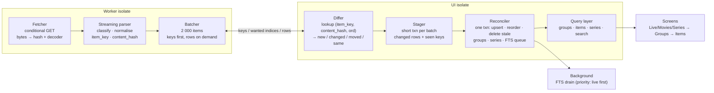

# Catalog Import & Browsing Redesign

**Status:** proposed design — supersedes the open items in
[`import-performance.md`](import-performance.md) §8, [`improvements-1.md`](improvements-1.md)
and [`implementation-plan4.md`](implementation-plan4.md) where they conflict.
Everything measured and learned in those documents still applies; this plan builds on it.

**Problem.** A real provider playlist (~70 MB, ~500 000 entries) takes 1.5–2 minutes to
refresh even when almost nothing has changed. Comparable apps do the same refresh in
10–20 seconds. Browsing is also flat (*all* live / *all* movies / *all* series), which is
both unfriendly on a TV remote and needlessly expensive.

**Goal.** One design for download → parse → SQLite → browse that is fast on the common
path (refresh with few changes), acceptable on the rare path (first import), reliable
under interruption, and bounded in memory on a TV.

---

## Part I — High level

### 1. Targets

Numbers are for the dev-machine benchmark harness at **500 000 items** unless stated.
Hardware targets (webOS TV, mid-range Android) are set after the first on-device baseline
(Phase 0) and are expected to be roughly 2–4× slower.

| Scenario | Today (extrapolated from 200k) | Target |
| --- | --- | --- |
| Refresh, playlist byte-identical to last time | ~100 s | **download time only** (or <1 s on HTTP 304) |
| Refresh, ≤5 % rows changed | ~100 s | **download + ≤ 15 s** |
| Refresh, order changed only | ~100 s (all rows rewritten) | download + ≤ 15 s |
| First import (cold) | ~85 s + ~50 s background index | **≤ 60 s** + background index, catalog browsable at 60 s |
| UI during import | parse freezes UI 5–8 s | **no frame > 100 ms**, remote stays responsive |
| Peak RSS delta during import | ~200–300 MB | **≤ 120 MB** over idle |
| Group list open → items shown | n/a (no group browsing) | **< 100 ms** from local DB |
| Data loss on kill/crash mid-import | catalog safe, user data safe | unchanged: **never lose user data or the last good catalog** |

### 2. Why the current design cannot reach these numbers

The current pipeline is already set-based and streaming (see `import-performance.md` §6);
the remaining cost is *structural*, not a missing index:

1. **Every row is staged and compared on every refresh.** 500k rows are written into
   `import_staging_items` (24 columns, ~10 s at 200k → ~25 s at 500k), then a 12-column
   `NOT EXISTS` predicate decides which are unchanged. The unchanged 95 % costs almost as
   much as the changed 5 %.
2. **Identity and keys are 69-character SHA-256 strings.** `media_items.id`,
   `category_id`, `series_id`, `season_id`, `episode_id` are all TEXT hashes, repeated in
   every index, in `episodes`, `favorites`, `watch_history`, `playback_progress` and the
   FTS shadow tables. Every b-tree page holds a fraction of the rows an integer key would;
   write amplification on eMMC is several times what it needs to be.
3. **One SHA-256 per item in the parser** (plus `providerItemHash` strings). At 500k items
   this is a measurable share of parse CPU on an ARM TV.
4. **Five catalog tables with FK cascades into user data.** `episodes`/`seasons`/`series`
   are derived navigation data maintained as real tables, and `favorites` etc. cascade on
   `media_items` deletes. Correctness code around this (identity resolve, fallback tiers)
   is the most complex code in the repository.
5. **The whole import runs inside one database transaction that stays open for the
   duration of the download.** Any user write (favourite, playback position) blocks; a
   slow network holds a write lock for minutes; a kill anywhere loses all progress.
6. **Nothing detects an unchanged playlist.** No `ETag`/`Last-Modified`, no content hash,
   no cooldown. Refreshing twice in an hour costs twice.
7. **Browsing is flat.** `showItems(kind)` pages through all items of a kind sorted by
   title. The `categories` table exists but no screen uses it, and `group_title` TEXT is
   repeated on every row.

### 3. Design principles

1. **Work is proportional to change, not to playlist size.** Decide "unchanged" as early
   and as cheaply as possible: at the HTTP layer, then on the whole body, then per row
   with one 64-bit integer compare. Only changed rows ever reach the write path.
2. **Integer keys everywhere.** `INTEGER PRIMARY KEY` rowids for catalog tables, 64-bit
   integer `item_key` for stable identity. Text is stored once.
3. **User data is decoupled from catalog rows.** Favourites, progress and history are keyed
   by `(playlist_id, item_key)` with **no foreign key** into catalog tables. The catalog can
   be dropped and rebuilt without touching user data.
4. **The database is owned by the UI isolate; the CPU work is not.** Download, decode,
   parse, classify and hash run in a worker isolate. The UI isolate only executes short
   SQL transactions. (Platform-channel `sqflite` on webOS/Android cannot be assumed to
   work from a background isolate — see §12.)
5. **Bounded memory.** No stage holds the whole playlist in any representation. One batch
   in flight between worker and UI isolate, backpressured.
6. **Short transactions, durable progress.** Batches commit independently under an
   `import_id`; one final small transaction publishes the result. A kill at any point
   leaves the previous catalog intact and the staging rows discardable.
7. **No silent slow paths.** If the fast path fails, the import fails loudly and the old
   catalog stays. (The current three-tier fallback that degrades to per-item savepoints
   has cost more debugging time than it has saved data — see `import-performance.md`
   §5.4.)
8. **Group-first browsing.** The provider's groups are the primary navigation unit; each
   group is a small, indexed query.
9. **Everything is observable.** Per-stage timings, counts of new/changed/removed rows,
   and the short-circuit tier that fired are recorded on the import session row and shown
   in verbose progress.

### 4. Architecture



Short-circuit tiers, checked in order:

| Tier | Check | Cost | Outcome when it fires |
| --- | --- | --- | --- |
| T0 | Cooldown: automatic refresh skipped if last success < `min_refresh_interval` (default 1 h). Manual refresh always proceeds. | 0 | nothing |
| T1 | HTTP `If-None-Match` / `If-Modified-Since` → `304` | one round trip | update `last_checked_at`, done |
| T2 | Streaming 64-bit hash of the raw body equals `playlists.source_content_hash` | download only, no parse writes | update `last_checked_at`, done |
| T3 | Per-row `(item_key, content_hash, ord)` lookup | ~500k index probes | only changed rows are written |

T2 is computed *while* parsing (the body has to be downloaded anyway), so the parse work
is not wasted if T2 fails — the batches are already flowing.

---

## Part II — Data model

### 5. Target catalog schema (implemented as migration v9)

All catalog tables are rebuildable. Timestamps are `INTEGER` unix seconds (cheaper than
ISO text and directly comparable). `playlist_id` stays TEXT (small table, user-facing id).

```sql
-- One row per group per kind. A provider group that mixes kinds becomes several rows.
CREATE TABLE groups (
  id           INTEGER PRIMARY KEY,
  playlist_id  TEXT    NOT NULL,
  kind         INTEGER NOT NULL,            -- 1 live, 2 movie, 3 series
  title        TEXT    NOT NULL,            -- provider group-title, trimmed
  sort_title   TEXT    NOT NULL,
  ord          INTEGER NOT NULL,            -- first appearance in playlist
  item_count   INTEGER NOT NULL DEFAULT 0,  -- maintained by reconciler
  UNIQUE (playlist_id, kind, title)
);

-- Flat catalog. One row per playlist entry. No FKs to user tables.
CREATE TABLE items (
  id            INTEGER PRIMARY KEY,
  playlist_id   TEXT    NOT NULL,
  item_key      INTEGER NOT NULL,           -- stable 64-bit identity (see §7)
  content_hash  INTEGER NOT NULL,           -- 64-bit hash of everything below except ord
  ord           INTEGER NOT NULL,           -- position in playlist
  kind          INTEGER NOT NULL,           -- 1 live, 2 movie, 3 episode
  group_id      INTEGER NOT NULL,
  title         TEXT    NOT NULL,
  sort_title    TEXT    NOT NULL,
  stream_url    TEXT    NOT NULL,
  logo_url      TEXT,
  tvg_id        TEXT,
  tvg_name      TEXT,
  tvg_chno      TEXT,
  xui_id        TEXT,
  series_key    INTEGER,                    -- hash64(playlist|group|series_title), episodes only
  series_title  TEXT,                       -- episodes only; source for the derived series table
  season_number INTEGER,
  episode_number INTEGER,
  UNIQUE (playlist_id, item_key)
);
CREATE INDEX idx_items_group_ord      ON items (group_id, ord);
CREATE INDEX idx_items_group_sort     ON items (group_id, sort_title);
CREATE INDEX idx_items_series_episode ON items (series_key, season_number, episode_number)
  WHERE series_key IS NOT NULL;

-- Derived per import from items WHERE kind = 3. Rebuilt only when any episode changed.
CREATE TABLE series (
  series_key    INTEGER PRIMARY KEY,
  playlist_id   TEXT    NOT NULL,
  group_id      INTEGER NOT NULL,
  title         TEXT    NOT NULL,
  sort_title    TEXT    NOT NULL,
  artwork_url   TEXT,
  season_count  INTEGER NOT NULL,
  episode_count INTEGER NOT NULL,
  ord           INTEGER NOT NULL             -- min(ord) of its episodes
);
CREATE INDEX idx_series_group_sort ON series (group_id, sort_title);

-- External-content FTS: no second copy of the title.
CREATE VIRTUAL TABLE items_fts USING fts5(
  title, tokenize = 'unicode61 remove_diacritics 2',
  content = 'items', content_rowid = 'id'
);
```

Removed: `categories`, `seasons`, `episodes`, `media_items`, `media_items_fts`,
`import_staging_items` (replaced below). `description`/`artwork_url` are dropped from the
M3U catalog — M3U carries neither; they return with Xtream metadata later as a separate
table keyed by `item_key`, not as columns here.

What is borrowed from the IPTV Extreme schema in [`database-schema.md`](database-schema.md):
integer ids, a flat item table with `ord`, a `grp` table with per-kind category, and
external-content FTS5. What is *not* borrowed: its trigram tokenizer (see §12.3) and the
wide metadata columns (Xtream-only, later).

### 6. Import bookkeeping and user data

```sql
CREATE TABLE import_sessions (
  id              INTEGER PRIMARY KEY,
  playlist_id     TEXT    NOT NULL,
  started_at      INTEGER NOT NULL,
  finished_at     INTEGER,
  state           TEXT    NOT NULL,          -- running | reconciling | done | unchanged | failed | cancelled | aborted
  tier            TEXT,                      -- which short-circuit fired: cooldown | http304 | body_hash | row_diff
  bytes_total     INTEGER, bytes_received INTEGER,
  items_parsed    INTEGER, items_rejected INTEGER,
  items_new       INTEGER, items_changed INTEGER, items_moved INTEGER, items_removed INTEGER,
  stage_timings   TEXT,                      -- JSON {stage: ms}
  error           TEXT
);

-- Only rows that are new or changed. Narrow on purpose.
CREATE TABLE import_rows (
  import_id     INTEGER NOT NULL,
  item_key      INTEGER NOT NULL,
  content_hash  INTEGER NOT NULL,
  ord           INTEGER NOT NULL,
  kind          INTEGER NOT NULL,
  group_kind    INTEGER NOT NULL, group_title TEXT NOT NULL,
  title TEXT NOT NULL, sort_title TEXT NOT NULL, stream_url TEXT NOT NULL,
  logo_url TEXT, tvg_id TEXT, tvg_name TEXT, tvg_chno TEXT, xui_id TEXT,
  series_key INTEGER, series_title TEXT, season_number INTEGER, episode_number INTEGER,
  PRIMARY KEY (import_id, item_key)
) WITHOUT ROWID;

-- Every key seen in this import (for stale detection) and its ord if it moved.
CREATE TABLE import_seen (
  import_id INTEGER NOT NULL,
  item_key  INTEGER NOT NULL,
  new_ord   INTEGER,                         -- NULL when unchanged
  PRIMARY KEY (import_id, item_key)
) WITHOUT ROWID;

-- playlists gains:
ALTER TABLE playlists ADD COLUMN source_etag TEXT;
ALTER TABLE playlists ADD COLUMN source_last_modified TEXT;
ALTER TABLE playlists ADD COLUMN source_content_hash INTEGER;
ALTER TABLE playlists ADD COLUMN source_content_length INTEGER;
ALTER TABLE playlists ADD COLUMN last_checked_at INTEGER;
ALTER TABLE playlists ADD COLUMN last_changed_at INTEGER;
ALTER TABLE playlist_settings ADD COLUMN min_refresh_interval_s INTEGER NOT NULL DEFAULT 3600;

-- User data: re-keyed, no FK to catalog.
CREATE TABLE favorites        (profile_id TEXT, playlist_id TEXT, item_key INTEGER, created_at INTEGER, PRIMARY KEY (profile_id, playlist_id, item_key));
CREATE TABLE playback_progress(profile_id TEXT, playlist_id TEXT, item_key INTEGER, position_ms INTEGER, duration_ms INTEGER, updated_at INTEGER, PRIMARY KEY (profile_id, playlist_id, item_key));
CREATE TABLE watch_history    (id INTEGER PRIMARY KEY, profile_id TEXT, playlist_id TEXT, item_key INTEGER, watched_at INTEGER, completed INTEGER, position_ms INTEGER, duration_ms INTEGER);
CREATE TABLE hidden_groups    (profile_id TEXT, playlist_id TEXT, kind INTEGER, group_title TEXT, PRIMARY KEY (profile_id, playlist_id, kind, group_title));
```

Joins from user data to the catalog go through `(playlist_id, item_key)` on the
`UNIQUE (playlist_id, item_key)` index. A favourite whose item disappeared from the
playlist simply produces no join row; it is shown as "unavailable" or purged lazily by a
maintenance job — it is never cascade-deleted by an import.

### 7. Identity and hashing

- **Hash function:** a 64-bit non-cryptographic hash (xxh3-64 via a pub package, or an
  in-house FNV-1a-64 over UTF-16 code units — Dart VM `int` is 64-bit two's-complement on
  every target platform, so the arithmetic is natural). Not SHA-256: it is ~10× cheaper and
  collision risk at $n = 5\cdot10^5$ is $\approx n^2 / 2^{65} \approx 7\cdot10^{-9}$.
- **`item_key`** = `hash64(stream_url)`. The URL is the thing the user actually plays and,
  for Xtream-style providers, embeds the provider's own stream id. Title edits
  ("Channel" → "Channel HD") keep favourites and progress. If the same URL appears more
  than once in a playlist, the second and later occurrences get
  `hash64(stream_url + '\u0000' + title + '\u0000' + n)` where `n` is the occurrence
  index; a `UNIQUE` violation on insert is treated as a hash collision and resolved the
  same way. Duplicate rate is recorded on the session for visibility.
- **`content_hash`** = `hash64` over every stored column *except* `ord`, `id`, `item_key`,
  in a fixed order with separators. A pure reorder of the playlist therefore produces
  `moved` rows (one integer `UPDATE ord` each) rather than rewrites.
- **`series_key`** = `hash64(playlist_id|group_kind|group_title|series_title)`; seasons are
  not entities, just `season_number` on episode rows.
- **Group identity** is `(playlist_id, kind, title)`; groups get a plain rowid.

Legacy `strongStableId`/`legacyStableId` remain only in the v8 migration to re-key existing
user rows (§14).

---

## Part III — Import pipeline in detail

### 8. Worker isolate

The worker owns the network and all per-item CPU. It is spawned per import and killed on
completion or cancel. Messages are the only coupling.

```text
UI → worker : start {url, etag?, lastModified?, batchSize}
worker → UI : headers {status, etag?, lastModified?, contentLength?}     (once)
worker → UI : progress {bytesReceived}                                    (throttled, ≤ 5/s)
worker → UI : keys   {batchNo, Int64List keys, Int64List hashes, Int32List ords, int firstOrd}
UI → worker : want   {batchNo, Int32List indices}     -- which rows the UI actually needs
worker → UI : rows   {batchNo, rows for those indices only}
worker → UI : done   {itemsParsed, itemsRejected, duplicateKeys, bodyHash, rejections[≤20]}
worker → UI : error  {message}
UI → worker : cancel
```

- **Download** uses `HttpClient` inside the worker (it is isolate-agnostic). Bytes are
  hashed for T2 as they arrive, then UTF-8 decoded with a streaming decoder that tolerates
  chunk boundaries inside multi-byte sequences (`utf8.decoder` as a `StreamTransformer`,
  not per-chunk `utf8.decode`). The UI isolate never sees the body.
- **Parser** is the existing `M3uStreamingParser` line machine, with the record builder
  producing a compact struct instead of `ContentItem`. The `#EXTINF` attribute regex is
  replaced by a hand-written scanner that only extracts `group-title`, `tvg-logo`,
  `tvg-id`, `tvg-name`, `tvg-chno`, `xui-id`, `type`/`content-type` (regex over every
  attribute on 500k lines is a real cost on ARM).
- **Classification** (kind) uses, in priority order: (1) Xtream URL path segments
  `/live/`, `/movie/`, `/series/`; (2) URL extension (`.mp4/.mkv/.avi` → VOD,
  `.ts/.m3u8` → live); (3) group-title hints (`vod|movie|film|series|serie`);
  (4) title matching the `SxxEyy` pattern → episode; (5) default live. Everything that
  is VOD and matches `SxxEyy` is an episode; other VOD is a movie.
- **Backpressure:** the worker holds at most one parsed batch while waiting for `want`. It
  keeps reading from the socket into a bounded line buffer, and pauses the HTTP
  subscription if that buffer exceeds ~1 MB.
- **Transfer cost:** `keys` messages are three typed arrays per 2 000 items (≈ 40 KB),
  sent via `TransferableTypedData` (moved, not copied). `rows` are sent only for the
  indices the UI asked for — on a 5 % churn refresh that is 5 % of the copying the current
  design does. On a cold import the UI asks for every index.

### 9. UI isolate: differ, stager, reconciler

Per batch (all inside one short transaction, ≈ 2 000 items):

1. **Lookup** `SELECT item_key, content_hash, ord FROM items WHERE playlist_id = ? AND item_key IN (…)`
   in chunks of ≤ 500 keys (the 999-parameter limit of older SQLite builds still
   applies — §12.2). Uses `UNIQUE (playlist_id, item_key)`.
2. **Classify** each key: *new* (absent), *changed* (hash differs), *moved* (hash same,
   ord differs), *same*.
3. **Reply** `want` with indices of *new* ∪ *changed*.
4. On `rows`: multi-row `INSERT INTO import_rows` (≤ 40 rows/statement).
5. **Seen:** multi-row `INSERT INTO import_seen (import_id, item_key, new_ord)` for every
   key in the batch (integers only; `new_ord` non-null for *moved*). ~500 statements for
   500k items.
6. Update `import_sessions` counters; **commit**.

On a **cold import** (no rows for this playlist) steps 1–3 are skipped: everything is
*new*, `import_seen` is not written, and rows can go straight into `items` in short
transactions with the secondary indexes **created afterwards** (drop-then-create is
cheaper than maintaining three b-trees during 500k inserts). The final reconcile then only
builds groups/series/FTS.

**Reconcile** (one transaction, after `done`, only on the warm path):

```sql
-- 1. groups: insert any new (kind, title), ord = first appearance
INSERT INTO groups (playlist_id, kind, title, sort_title, ord)
SELECT ?, group_kind, group_title, LOWER(TRIM(group_title)), MIN(ord)
FROM import_rows WHERE import_id = ? GROUP BY group_kind, group_title
ON CONFLICT (playlist_id, kind, title) DO NOTHING;

-- 2. new + changed rows
INSERT INTO items (playlist_id, item_key, content_hash, ord, kind, group_id, title, sort_title,
                   stream_url, logo_url, tvg_id, tvg_name, tvg_chno, xui_id,
                   series_key, series_title, season_number, episode_number)
SELECT ?, r.item_key, r.content_hash, r.ord, r.kind, g.id, r.title, r.sort_title,
       r.stream_url, r.logo_url, r.tvg_id, r.tvg_name, r.tvg_chno, r.xui_id,
       r.series_key, r.series_title, r.season_number, r.episode_number
FROM import_rows r JOIN groups g ON g.playlist_id = ? AND g.kind = r.group_kind AND g.title = r.group_title
WHERE r.import_id = ?
ON CONFLICT (playlist_id, item_key) DO UPDATE SET
  content_hash = excluded.content_hash, ord = excluded.ord, kind = excluded.kind,
  group_id = excluded.group_id, title = excluded.title, sort_title = excluded.sort_title,
  stream_url = excluded.stream_url, logo_url = excluded.logo_url, tvg_id = excluded.tvg_id,
  tvg_name = excluded.tvg_name, tvg_chno = excluded.tvg_chno, xui_id = excluded.xui_id,
  series_key = excluded.series_key, series_title = excluded.series_title,
  season_number = excluded.season_number, episode_number = excluded.episode_number;

-- 3. moved rows
UPDATE items SET ord = (SELECT new_ord FROM import_seen s WHERE s.import_id = ? AND s.item_key = items.item_key)
WHERE playlist_id = ? AND item_key IN (SELECT item_key FROM import_seen WHERE import_id = ? AND new_ord IS NOT NULL);

-- 4. stale rows
DELETE FROM items WHERE playlist_id = ?
  AND item_key NOT IN (SELECT item_key FROM import_seen WHERE import_id = ?);

-- 5. group counts, remove empty groups
UPDATE groups SET item_count = (SELECT COUNT(*) FROM items i WHERE i.group_id = groups.id) WHERE playlist_id = ?;
DELETE FROM groups WHERE playlist_id = ? AND item_count = 0;

-- 6. series: rebuild only if any import_row or deleted row had kind = 3
DELETE FROM series WHERE playlist_id = ?;
INSERT INTO series SELECT series_key, ?, group_id, MIN(series_title), LOWER(TRIM(MIN(series_title))), MIN(logo_url),
       COUNT(DISTINCT season_number), COUNT(*), MIN(ord)
FROM items WHERE playlist_id = ? AND kind = 3 GROUP BY series_key;

-- 7. FTS queue: new/changed ids (+ deleted ids captured before step 4)
-- 8. playlists: source_* columns, last_changed_at; import_sessions: done + counters
-- 9. DELETE FROM import_rows/import_seen WHERE import_id = ?
```

Step 5's `COUNT(*)` per group is one pass over `idx_items_group_ord` (~1 s at 500k); on a
warm refresh it can be restricted to groups touched by `import_rows` or deletes.
Step 6 sorts ~150k episode rows; with the partial index on `series_key` it is a few
seconds cold and is skipped entirely when no episode row changed.

`series_title` is stored on episode rows in `items` (one nullable TEXT column) rather than
re-derived from `title` in SQL with `substr`/`instr`; the parser already has it, and the
SQL variant is fragile against provider title formats.

### 10. Transactions, durability and recovery

- **No transaction is ever open across a network wait.** Each batch is its own
  transaction; the worker's `keys` message is what triggers it.
- `import_sessions.state` machine: `running` → `reconciling` → `done` | `unchanged`;
  `failed` | `cancelled` from any state. Because reconcile is a single SQLite transaction,
  a kill during `reconciling` rolls back to the previous catalog automatically.
- **Startup:** any session left in `running`/`reconciling` → delete its
  `import_rows`/`import_seen`, mark `aborted`. Cheap, and the next refresh simply redoes
  the work (it is a diff, so it is fast).
- **Resume** of a half-downloaded playlist is *not* attempted: HTTP range support is
  unreliable across providers, and a diff-based re-run is cheap enough.
- **Cancellation:** `cancel` to the worker, then the same cleanup as an abort. The
  coordinator's existing per-playlist job sharing (`CatalogImportCoordinator.run`) stays.
- **Failure policy:** any SQL error in stage or reconcile fails the import, records the
  error on the session, and leaves the previous catalog. There is **no** Dart-loop or
  per-item fallback. Bad *rows* (missing URL/title) are rejected by the parser and counted;
  they never reach SQL.
- **Read/write concurrency:** browsing reads happen between batch transactions, so a user
  can navigate during an import. Whether to enable WAL to let reads overlap writes is
  re-measured under the new short-transaction shape (the earlier 10× regression was caused
  by one huge transaction; see §12.4).

### 11. Post-import: search index

- `items_fts` is external-content: the `title` text lives only in `items`. Index updates
  use the FTS5 `'delete'` command with the old title and a plain insert with the new one,
  so a queue row must carry the old title for changed/deleted items. The queue becomes
  `search_index_queue (item_id INTEGER PRIMARY KEY, op, old_title, priority)`.
- Cold import: `INSERT INTO items_fts(items_fts) VALUES('rebuild')` in the background, in
  the same worker style as today, but **prioritised by kind** (live first, then movies,
  then episodes) so search over channels works within seconds of the catalog appearing.
  Implemented as `INSERT INTO items_fts(rowid, title) SELECT id, title FROM items WHERE
  kind = ? AND id BETWEEN ? AND ?` in bounded batches (rebuild is one long statement and
  would block the connection).
- Search UI shows "indexing…" with a count while the drain is running (today it is
  invisible; see `import-performance.md` §8.2).

---

## Part IV — Browsing

### 12. Information architecture

```text
Home ── Continue Watching · Favourites · Recently watched · Live groups row
 ├─ Live TV   → Groups (count, playlist order)      → Channels in group (playlist order, logo, chno)  → Player
 ├─ Movies    → Groups (count)                       → Poster grid (title order or playlist order)     → Details → Player
 ├─ Series    → Groups (count)                       → Series in group → Seasons → Episodes             → Player
 ├─ Search    → global FTS, filter chips by kind, results show group name
 └─ Settings  → playlists · hide groups · refresh policy · verbose import info
```

Rules:

- Group lists come from `groups` (`WHERE playlist_id = ? AND kind = ? AND title NOT IN
  hidden ORDER BY ord|sort_title`) — a few hundred rows, one query, counts precomputed.
- Item lists within a group are `WHERE group_id = ? ORDER BY ord LIMIT 100 OFFSET ?` on
  `idx_items_group_ord`. Never a full-kind scan.
- Every list remembers its last focused row per group (in memory; persisted for the
  Live TV group the user was last in).
- "All channels" is offered as a synthetic entry at the top of the live group list for
  users who want it, backed by the existing kind-wide paged query.
- Hidden groups (`hidden_groups`, per profile) are excluded from group lists, item counts
  on Home, and search results.
- Group naming is shown as-is from the provider in v1; derived country/language/category
  facets (spec §35) remain future work and would live on `groups`, not on items.

### 13. Query layer changes

`CatalogQueryService` gains:

```dart
Future<List<GroupSummary>> groups(String playlistId, {required CatalogItemKind kind, GroupSort sort});
Future<CatalogPage<CatalogItemSummary>> itemsInGroup(int groupId, {int offset, int limit, CatalogSort sort});
Future<CatalogPage<SeriesSummary>> seriesInGroup(int groupId, {int offset, int limit});
Future<List<SeasonSummary>> seasons(int seriesKey);               // GROUP BY season_number
Future<CatalogPage<CatalogItemSummary>> episodes(int seriesKey, int seasonNumber, {int offset, int limit});
Future<CatalogPage<CatalogItemSummary>> search(String playlistId, String term, {Set<CatalogItemKind> kinds, int? groupId, int offset, int limit});
```

`CatalogItemSummary` carries `id` (int rowid), `itemKey` (int), `groupId`, `kind`,
`title`, `logoUrl`, `tvgChno`, `ord`, `seasonNumber`/`episodeNumber`. `stream_url` is
fetched only for the selected item (`itemById`). `CatalogViewState` gets a
`PagedCollection<GroupSummary>` and per-group `PagedCollection` instances keyed by group
id (LRU of a handful) so backing out of a group does not refetch it.

Screens: `catalog_screen.dart` splits into `group_list_screen.dart` (kind-parameterised)
and `group_items_screen.dart`; series/season/episode screens re-point to the new queries.
`AppScreen` gains `liveGroups`, `movieGroups`, `seriesGroups`, `groupItems`.

---

## Part V — Platform and resilience

### 14. Platform constraints (verify on hardware before relying on them)

1. **SQLite access from a background isolate.** `sqflite_common_ffi` (Windows/Linux)
   works from any isolate. Platform-channel `sqflite` on Android documents background
   use via `BackgroundIsolateBinaryMessenger` + `RootIsolateToken` on Flutter ≥ 3.7;
   `sqflite_webos` has not been verified. **The design does not depend on it** — all SQL
   runs on the UI isolate in short transactions. Moving the differ/stager into a
   dedicated DB isolate is an optional Phase 6 if a webOS spike proves it works.
2. **Bound parameter limit.** System SQLite on older Android is built with
   `SQLITE_MAX_VARIABLE_NUMBER = 999`; newer builds allow 32 766. Keep ≤ 500 keys per `IN`
   list and ≤ 40 rows per multi-row insert (18 columns × 40 = 720). If we later bundle our
   own SQLite (`sqlite3_flutter_libs` + `sqflite_common_ffi` on Android) these limits and
   the SQLite version become ours to choose; that decision is deferred to after Phase 0
   hardware numbers.
3. **FTS tokenizer.** `trigram` (used by IPTV Extreme) gives substring matching
   ("sport" finds "Eurosport") but needs SQLite ≥ 3.34, triples index size and tokenises
   slower. Ship `unicode61` prefix matching; evaluate `trigram` in Phase 5 once the SQLite
   version on each platform is known. Search UI can compensate by also matching
   `sort_title LIKE '%term%'` within the current group (a few hundred rows).
4. **WAL.** Rejected earlier because one giant import transaction outgrew the page cache.
   With ≤ 2 000-row transactions that argument disappears and WAL would let browsing reads
   proceed during import. Re-measure in Phase 3; keep `synchronous = NORMAL`.
5. **Memory.** Worker: one batch (~2 000 structs, ~1 MB) + line buffer (≤ 1 MB) + decoder
   state. UI: one batch of typed arrays + one `rows` message. SQLite cache 8 MiB. The 70 MB
   body is never resident; the parsed playlist is never resident. That is what makes the
   ≤ 120 MB target realistic on a TV.
6. **Timeouts.** The current 20 s *total* timeout on the streaming download is wrong for a
   70 MB body on a slow TV connection; use a 20 s *idle* timeout between chunks plus a
   generous overall cap (10 min), both surfaced to the user.

### 15. Failure matrix

| Failure | Behaviour |
| --- | --- |
| Network down / DNS / 5xx | T1 request fails → import `failed`, old catalog shown, retry hint. Cooldown not reset. |
| 304 Not Modified | `unchanged`, `last_checked_at` updated, no parse. |
| Body identical (T2) | `unchanged`, no reconcile; any staged batches (already diffed as *same*) are discarded. |
| Download stalls | idle timeout → `failed`, cleanup; nothing written to `items`. |
| Malformed lines | rejected by parser, counted, first 20 recorded; import continues. |
| Every line rejected | `failed` with `playlistFormatInvalid`; catalog untouched. |
| Hash collision on `item_key` | resolved deterministically (§7); counted on the session. |
| SQL error in a batch | import `failed`; staged rows deleted; catalog untouched. No fallback path. |
| Kill during staging | session `running` at next start → cleanup, `aborted`. Catalog untouched. |
| Kill during reconcile | SQLite rolls back; session `reconciling` → `aborted`. |
| Kill during FTS drain | queue survives; drain resumes at startup (already implemented). |
| User cancels | worker killed, cleanup, `cancelled`. |
| Two refreshes of one playlist | coordinator shares the in-flight job (already implemented). |
| Schema migration to v8 | catalog dropped, user data re-keyed, playlist flagged for re-import; refresh starts automatically on next launch with the old UI showing "updating catalog". |

### 16. Migration to v8

The v8 migration is destructive for catalog tables and preserving for user tables:

1. Create new user tables; copy `favorites`, `playback_progress`, `watch_history` by
   joining old `media_items` on the old TEXT id to obtain `stream_url` and `title`, then
   compute `item_key = hash64(stream_url)` in Dart (migrations are Dart code, so this is a
   read-all-user-rows loop — user tables are small). Rows whose media row no longer exists
   are dropped (they were already unreachable).
2. Copy `hidden_categories` → `hidden_groups` via `categories.provider_group_title` for
   each kind that group had items in.
3. Drop all old catalog tables, staging table, queue and FTS. Create the v8 tables.
4. Set `playlists.last_import_status = 'never'`, `search_index_dirty = 0`, clear
   `source_*` so the first v8 refresh is a cold import.
5. `AppController.initialize()` triggers a refresh for the active playlist when its status
   is `never` and it has a URL.

Occurrence-index disambiguation (§7) cannot be reproduced for legacy duplicates; user rows
on the second-or-later duplicate of a URL will attach to the first. Acceptable.

---

## Part VI — Implementation plan

Each phase ends with the benchmark harness run at 500k (cold, identical refresh, 5 % churn,
reorder-only) and the full test suite green. Phases 1 and 2 are independent of each
other; 3 depends on 2; 4 depends on 2; 5 and 6 are optional tuning.

### Phase 0 — Measure (harness + hardware baseline)

- Extend `tool/synthetic_playlist.dart` with Xtream-style URLs (`/live/u/p/123.ts`,
  `/movie/u/p/456.mkv`, `/series/u/p/789.mkv`), realistic group names, ~5 % duplicate
  URLs, and a `reorderSyntheticPlaylist` variant.
- Extend `tool/benchmark_import.dart` with scenarios `identical`, `churn5`, `reorder`,
  reporting the short-circuit tier, per-stage timings from `import_sessions.stage_timings`,
  and peak RSS.
- Run the current build on a webOS TV and an Android phone with the 500k playlist; record
  numbers in this document. These set the hardware targets.
- Add a frame-timing probe (max frame build time during import) to the verbose progress
  panel for on-device checks.

### Phase 1 — Short-circuits on the current schema (quick win)

- `HttpPlaylistSource`: send `If-None-Match`/`If-Modified-Since`, surface response
  headers; handle `304`.
- Streaming body hash (xxh3-64 or FNV-1a-64) in the download path; new `source_*` columns
  (as a v8a migration, additive).
- Cooldown for automatic refreshes (`min_refresh_interval_s`), manual refresh bypasses it.
- `import_sessions` table with `tier` recorded; verbose progress shows "Playlist unchanged
  (checked in 0.8 s)".
- Idle-based download timeout.
- **Gate:** identical refresh ≤ download time; 304 path < 1 s; tests for each tier.

### Phase 2 — Schema v8 and the diff pipeline

- Migration v8 (§16) with tests: user rows survive re-keying; hidden groups survive.
- Worker isolate with the message protocol in §8: download + decode + parse + classify +
  hash inside the worker; `keys`/`want`/`rows` batching with `TransferableTypedData`.
- Differ/stager/reconciler (§9) in a new `CatalogImporter` class; `SqliteCatalogRepository`
  shrinks to session orchestration + query layer. Delete `_reconcilePlaylistContent`,
  `_reconcileResiliently`, the staging SQL path and the Dart-loop fallback.
- Cold-import fast path (indexes built after bulk insert).
- Startup cleanup of aborted sessions; cancellation.
- Rewrite `queryItems`/`homePreview`/`itemById` against `items`; keep the flat kind views
  working so the app is usable before Phase 3.
- Tests: identity stability (title change keeps `item_key`), duplicate URL handling, moved
  rows only update `ord`, stale deletion, series rebuild skipped when no episode changed,
  kill-during-staging cleanup (simulate by closing the adapter), no transaction open across
  a `keys` wait (assert via a concurrent write succeeding mid-import).
- **Gate:** 5 % churn ≤ download + 15 s at 500k; cold ≤ 60 s + background index; peak RSS
  delta ≤ 120 MB; `onStagingReconcileFallback` and the fallback code no longer exist.

### Phase 3 — Group-first browsing

- Query layer additions (§13), `GroupSummary`, `CatalogViewState` group collections.
- Screens: group lists for Live/Movies/Series, group item lists, series → seasons →
  episodes on the new keys, "All channels" entry, hidden-groups management in Settings,
  remembered focus per group.
- Home: Live groups row, Continue Watching/Favourites/Recent joined by `item_key`.
- Search: results carry group name; kind filter chips; "indexing…" state.
- Tests: `groups()` excludes hidden, counts match, paging within a group is by `ord`,
  focus restoration on back navigation (widget tests).
- **Gate:** group open → first page < 100 ms on desktop; no query without a `group_id`,
  `series_key` or FTS predicate in the browsing screens.

### Phase 4 — Search index and post-import polish

- External-content FTS with old-title deletes; prioritised cold rebuild by kind;
  UI "indexing" state and progress.
- Group-count maintenance restricted to touched groups on warm refresh.
- **Gate:** live-channel search available ≤ 10 s after a cold import completes at 500k;
  warm refresh reindexes only changed rows.

### Phase 5 — Hardware tuning

- Re-measure WAL vs rollback journal under short transactions on webOS and Android.
- Batch size sweep (1 000 / 2 000 / 5 000) on hardware.
- Decide on bundled SQLite (`sqlite3_flutter_libs`) for Android based on the parameter
  limit and version findings; evaluate `trigram` FTS.
- Optional raw-playlist file cache (spec §28) for debugging/reprocessing, behind a setting.

### Phase 6 — Optional: DB isolate

- Only if Phase 5 shows the UI isolate's SQL time still causes jank on the TV: spike
  `sqflite_webos` from a background isolate; if it works, move differ/stager into a
  dedicated DB isolate. The protocol in §8 already isolates this change.

---

## Part VII — Acceptance criteria

Import (dev harness, 500k):

- [ ] Identical playlist: tier `body_hash` or `http304`; total ≤ download time; zero rows in `import_rows`.
- [ ] 5 % churn: `items_changed ≈ 25 000`, `items_new + items_removed` as generated; total ≤ download + 15 s.
- [ ] Reorder only: `items_moved ≈ 500 000`, `items_changed = 0`; total ≤ download + 15 s.
- [ ] Cold: ≤ 60 s to `done`; live search available ≤ 10 s later.
- [ ] Peak RSS delta ≤ 120 MB in all four scenarios.
- [ ] A favourite on an item whose title changed is still a favourite afterwards.
- [ ] A write (`setFavorite`) issued in the middle of a 500k import completes in < 200 ms.
- [ ] Killing the process at any point leaves the previous catalog fully browsable on restart.

Browsing:

- [ ] Live/Movies/Series each open to a group list with counts; every item list is scoped to a group, series or search.
- [ ] Hidden groups disappear from lists, Home counts and search.
- [ ] Back from a group list restores focus to the group that was open.

Hardware (webOS TV, Android phone): the same scenarios, numbers recorded here after Phase 0
and Phase 5, with the TV allowed ~3× the desktop time and no frame > 100 ms during import.

---

## Part VIII — Open decisions to verify

| # | Question | How to resolve | Blocks |
| --- | --- | --- | --- |
| 1 | Does `sqflite_webos` work from a background isolate? | 1-day spike on the TV | Phase 6 only |
| 2 | SQLite version and `SQLITE_MAX_VARIABLE_NUMBER` on webOS 26 and target Android versions | `SELECT sqlite_version()` + a 1 000-parameter probe at startup, logged | Phase 5 decisions |
| 3 | Do real providers send `ETag`/`Last-Modified` and honour conditional GET? | Log headers for the user's playlists in Phase 1 | value of T1 (T2 works regardless) |
| 4 | Duplicate-URL rate in real playlists | Session counter from Phase 2 | `item_key` rule tuning |
| 5 | `trigram` vs `unicode61` for TV search UX | Phase 5 A/B on hardware with real titles | search quality |
| 6 | Is the Xtream URL-path classifier reliable for the user's providers? | Session counters per classification source in Phase 2 | group kinds |
| 7 | Should moved-only refreshes update `ord` at all when the user sorts by title? | Product call; cheap either way | none |
